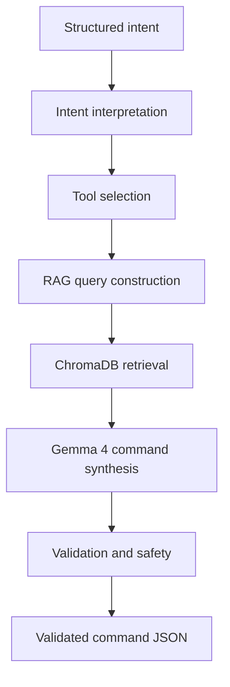

# NeuroShell — Component 02

## Dynamic Planner & RAG Engine

NeuroShell Component 02 converts structured cybersecurity intents received from Component 01 into safe, validated, and executable Linux security-tool commands. It combines deterministic tool selection, Retrieval-Augmented Generation (RAG), a locally hosted LLM, command validation, safety filtering, and session-aware target recovery.

> This component is intended only for educational research and authorized security testing in controlled environments.

## Component Responsibility

| Input | Processing | Output |
|---|---|---|
| Structured intent JSON from Component 01 | Interpret intent, select a tool, retrieve documentation, synthesize and validate a command | Validated command plan with tool, session, sources, and status metadata |

The current implementation supports these primary workflows:

| Intent | Selected tool | Example purpose |
|---|---|---|
| `NETWORK_SCAN` | Nmap | Discover ports and services |
| `VULNERABILITY_AUDIT` | Nikto | Audit an authorized web server |
| `DIRECTORY_BRUTEFORCE` | Gobuster | Discover web paths using an approved wordlist |

## Architecture



### Processing Pipeline

1. Validate and normalize the incoming intent schema.
2. Recover the previous authorized target from session context when appropriate.
3. Select Nmap, Nikto, or Gobuster using the tool-selection layer.
4. Construct a retrieval query from the intent, target, ports, and modifiers.
5. Retrieve relevant command documentation from ChromaDB using `all-MiniLM-L6-v2` embeddings and a relevance threshold.
6. Assemble the retrieved context once and provide it to the locally hosted Gemma 4 model through Ollama.
7. Validate syntax, tool usage, target range, flags, documentation support, and destructive patterns.
8. Return the accepted plan or reject the request early with an appropriate API response.

## Technology Stack

| Technology | Purpose |
|---|---|
| Python | Core implementation |
| FastAPI | REST API on port `8002` |
| Ollama + Gemma 4 | Local command synthesis |
| ChromaDB | Local vector database |
| SentenceTransformers | `all-MiniLM-L6-v2` embeddings |
| Redis | Session context with graceful in-memory fallback |
| Pytest | Unit and integration testing |

## Project Structure

```text
neuroshell-planner/
├── data/
│   ├── synthesis_dataset/
│   └── tool_map.json
├── knowledge_base/
├── scripts/
│   ├── evaluate_component.py
│   ├── ingest_docs.py
│   └── verify_tuned_c2_model.py
├── src/
│   ├── api/
│   ├── intent/
│   ├── rag/
│   ├── schemas/
│   ├── session/
│   ├── synthesis/
│   └── validation/
├── tests/
├── .gitignore
├── README.md
└── requirements.txt
```

Local model files, secrets, virtual environments, and generated runtime data must not be committed.

## Setup on Windows

### 1. Clone the repository

```powershell
git clone https://github.com/NeuroShell-Framework/Component-02-Dynamic-Planner.git
cd Component-02-Dynamic-Planner
```

### 2. Create and activate a virtual environment

```powershell
python -m venv venv
.\venv\Scripts\Activate.ps1
```

### 3. Install dependencies

```powershell
pip install -r requirements.txt
```

### 4. Configure environment variables

Create a local `.env` file based on the project's configuration requirements. Do not commit `.env`, credentials, API keys, or private target information.

Important runtime services:

| Service | Default location |
|---|---|
| Component 02 API | `http://localhost:8002` |
| Redis | `localhost:6379` |
| ChromaDB | Local persistent storage |
| Ollama | Independent local instance |

### 5. Verify Ollama and the model

```powershell
ollama list
```

The default model is configured through `OLLAMA_MODEL`; the current planner uses Gemma 4.

### 6. Build or update the knowledge base

```powershell
python scripts/ingest_docs.py
```

### 7. Start the API

```powershell
uvicorn src.api.main:app --host 0.0.0.0 --port 8002
```

Open the interactive documentation at:

```text
http://localhost:8002/docs
```

## API Endpoints

| Method | Endpoint | Purpose |
|---|---|---|
| `POST` | `/plan` | Generate and validate a command plan |
| `POST` | `/kb/update` | Add new knowledge-base documentation without retraining |
| `GET` | `/tools/available` | List the tools available to the planner |

Protected endpoints require the configured `x-api-key` header.

### Example planning request

```json
{
  "intent": "NETWORK_SCAN",
  "sub_intent": "STEALTH_SCAN",
  "target": {
    "type": "subnet",
    "value": "192.168.1.0/24"
  },
  "ports": [],
  "modifiers": ["service_detection"],
  "tool_hint": "nmap",
  "confidence": 0.95,
  "session_id": "research-demo-001"
}
```

The exact accepted schema is defined in the source models and should be treated as authoritative.

### Response information

A successful plan includes fields such as:

- Generated command
- Selected tool
- Session identifier
- Intent reference
- Retrieval sources
- Validation status
- Latency and processing metadata where enabled

## Retrieval-Augmented Generation

The RAG layer retrieves tool documentation before command synthesis. Documentation is embedded with `all-MiniLM-L6-v2` and stored in ChromaDB. Retrieval uses a relevance threshold to prevent unrelated context from influencing command generation.

The knowledge base can be updated through `/kb/update`, allowing new approved documentation to become available without retraining the LLM.

## Session Management

Redis stores short-lived planning context and supports follow-up requests, including recovery of the last authorized target for a session. The session layer degrades safely to an in-memory fallback when Redis is unavailable, preventing Redis connection failures from crashing the planning API.

## Validation and Safety

The command validator and safety filter check:

- Allowed cybersecurity tools
- Valid command structure and syntax
- RFC 1918/private authorized targets
- Target consistency
- Unsupported or unsafe flags
- Dangerous and destructive command patterns
- Whether command elements are supported by retrieved documentation

Invalid generated commands are rejected and are not returned as executable plans. Generated commands must still be reviewed by an authorized operator before execution.

## Testing and Evaluation

The test suite covers the main pipeline modules:

- Intent interpreter
- Query constructor
- Vector retriever
- Tool selector
- Safety filter
- Command validator
- Session context manager
- `/plan` API integration
- Administrative API behavior

Run the automated tests with:

```powershell
pytest -v
```

Run component evaluation with:

```powershell
python scripts/evaluate_component.py
```

Evaluation focuses on:

| Metric | Description |
|---|---|
| Tool-selection accuracy | Correct tool chosen for the supplied intent |
| Command syntax validity | Generated command follows valid tool syntax |
| Retrieval relevance | Retrieved documentation matches the task |
| Safety rejection | Unsafe or unauthorized requests are blocked |
| API success rate | Valid requests complete with the expected response |
| Latency | End-to-end planning response time |

## Current Development Status

### Completed

- [x] FastAPI planning service (`POST /plan` on port 8002)
- [x] Structured intent interpretation (Enriched C1 v2 & Legacy C1 v1)
- [x] Nmap, Nikto, and Gobuster tool selection
- [x] ChromaDB RAG integration & relevance score thresholding (`0.30`)
- [x] Gemma 4 (`gemma4:e4b`) default production LLM command synthesis
- [x] Gemma 2 SFT LoRA fine-tuning (`google/gemma-2-2b-it`), GGUF conversion & deployment (`neuroshell-c2-gemma2:latest`)
- [x] Multi-command array generation (`command_sequence`) & per-command dual validation
- [x] Strict command validation (HTTP 422 for structural failures) and safety filtering
- [x] Rejected-intent early exit (HTTP 400)
- [x] Redis session management with graceful in-memory fallback
- [x] Session target recovery (`get_last_target`)
- [x] Dataset filtering, AST validator, and evaluation utilities
- [x] Automated test suite (51 / 51 tests passing across unit and integration tests)
- [x] Final C1 $\rightarrow$ C2 $\rightarrow$ C3 API Contract Audit (PASS / Ready for Integration)

### Planned / Unimplemented Future Work

- [ ] Component 03 dynamic execution feedback loop processing execution logs
- [ ] Adaptive tool chaining based on session execution history
- [ ] Production integration with Component 03 execution engine

## Ethical Use and Disclaimer

NeuroShell is intended exclusively for academic research, education, and authorized cybersecurity testing. Do not generate or execute commands against any system, network, application, or device without explicit permission. The developers are not responsible for misuse.

## Research Project

NeuroShell is a multi-component cybersecurity research framework. Component 01 produces structured cybersecurity intent, while Component 02 transforms that intent into a safe command plan using tool selection, RAG, local LLM synthesis, validation, and session context.

**Component 02 Developer:** HERATH H.M.C.H.K  
**Repository:** https://github.com/NeuroShell-Framework/Component-02-Dynamic-Planner
