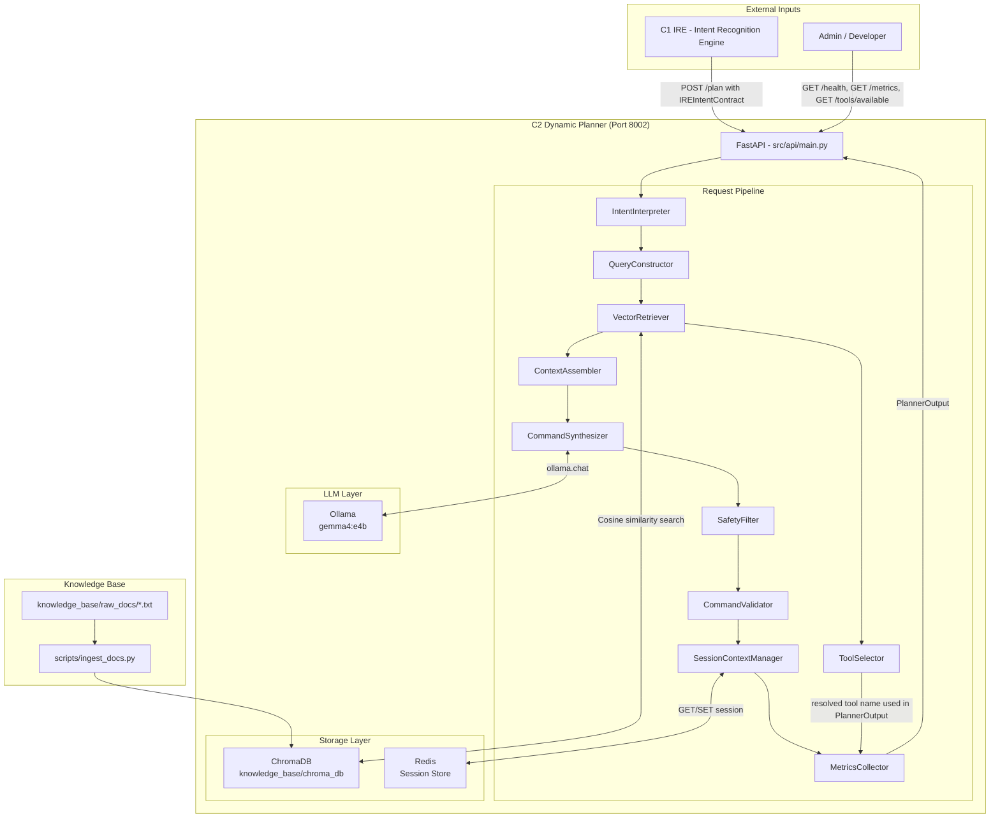

# 01 — System Overview

> **Component scope:** C2 **plans, generates, and validates** penetration-testing commands. It does **not** execute them. Execution is the responsibility of C3 — the Adaptive Execution & Error Recovery Engine.

## 1.1 Purpose

The **NeuroShell Dynamic Planner & RAG Engine (C2)** is a RAG-powered command synthesis microservice. Given a structured `IREIntentContract` produced by C1 (Intent Recognition Engine), C2:

1. Interprets the intent and extracts actionable parameters.
2. Constructs a semantic query and retrieves relevant tool documentation from a local vector store (ChromaDB).
3. Assembles a grounded LLM prompt and synthesizes a Kali Linux bash command via a local Gemma model (Ollama).
4. Runs the synthesized command through a safety filter and a structural validator.
5. Updates session state in Redis and records metrics.
6. Returns a structured `PlannerOutput` to the caller (C3) for execution.

---

## 1.2 Design Goals

| Goal | Implementation |
|---|---|
| **Grounded generation** | RAG retrieval prevents hallucinated flags; LLM only sees documented options |
| **Safety-first** | Dual-layer validation — `SafetyFilter` (pre-execution) + `CommandValidator` (structural) |
| **Stateful sessions** | Redis TTL sessions track targets, commands, and tools across requests |
| **LLM-agnostic** | Ollama abstraction allows model swap via `OLLAMA_MODEL` env var |
| **Zero external calls** | All inference is local (Ollama + ChromaDB); no third-party API required |
| **Intent enforcement** | `REJECTED` intents are blocked before any RAG or LLM processing |

---

## 1.3 System Architecture



---

## 1.4 Repository Layout

```
neuroshell-planner/
├── .env                          # Environment configuration
├── requirements.txt              # Python dependencies
├── data/
│   ├── tool_map.json             # Intent → tool fallback mapping
│   └── synthesis_dataset/        # (Reserved for fine-tuning data)
├── docs/                         # ← This documentation
├── knowledge_base/
│   ├── raw_docs/                 # Source .txt files for ingestion
│   ├── processed/                # (Intermediate processing artifacts)
│   └── chroma_db/                # Persisted ChromaDB vector store
├── models/
│   └── planner-lora-adapter/     # (Reserved for LoRA adapter weights)
├── scripts/
│   ├── ingest_docs.py            # KB ingestion pipeline
│   └── evaluate_component.py     # End-to-end evaluation harness
├── src/
│   ├── api/
│   │   └── main.py               # FastAPI application + all endpoints
│   ├── intent/
│   │   ├── intent_interpreter.py # IREIntentContract → params dict
│   │   └── query_constructor.py  # params dict → RAG query string
│   ├── rag/
│   │   ├── vector_retriever.py   # ChromaDB cosine search
│   │   └── context_assembler.py  # docs + params → LLM prompt
│   ├── schemas/
│   │   └── models.py             # All Pydantic models
│   ├── session/
│   │   └── session_context_manager.py  # Redis session CRUD
│   ├── synthesis/
│   │   ├── command_synthesizer.py      # Ollama LLM call
│   │   └── tool_selector.py            # Priority-based tool resolution
│   ├── utils/
│   │   └── metrics_collector.py        # In-memory metrics
│   └── validation/
│       ├── command_validator.py        # Structural command checks
│       └── safety_filter.py            # Dangerous pattern filter
└── tests/
    ├── unit/
    └── integration/
```

---

## 1.5 Technology Stack

| Layer | Technology | Version | Notes |
|---|---|---|---|
| Web Framework | FastAPI | 0.111.0 | — |
| ASGI Server | Uvicorn | 0.29.0 | — |
| Data Validation | Pydantic v2 | 2.7.1 | — |
| LLM Runtime | Ollama | 0.2.0 | Local LLM inference |
| Default Production LLM | Gemma 4 (`gemma4:e4b`) | — | Default model via `OLLAMA_MODEL` env var |
| Experimental Fine-Tuned LLM | Gemma 2 LoRA (`neuroshell-c2-gemma2:latest`) | 2b-it | Fine-tuned GGUF adapter deployed in Ollama |
| Vector Store | ChromaDB | 0.5.0 | Embedded, file-based |
| Embedding Model | `all-MiniLM-L6-v2` | sentence-transformers 3.0.0 | — |
| Session Store | Redis | 5.0.4 (client) | With in-memory fallback |
| LangChain | `langchain`, `langchain-community` | 0.2.0 | Listed in `requirements.txt`; not directly called by any C2 module |
| Testing | pytest + pytest-asyncio | 8.2.0 / 0.23.6 | Full suite: 51 / 51 tests passing (0 failures) |

---

## 1.6 NeuroShell Component Map

Terminology from the research proposal:

| Component | Formal Name | Role |
|---|---|---|
| C1 | **Intent Recognition Engine (IRE)** | Classifies natural-language input into structured `IREIntentContract` |
| C2 | **Dynamic Planner & RAG Engine** | This component — synthesizes validated bash commands |
| C3 | **Adaptive Execution & Error Recovery Engine** | Executes commands, monitors results, handles errors |
| C4 | **AI-Driven Vulnerability Analysis Engine** | Analyzes execution output for vulnerability insights |

---

## 1.7 Proposal vs. Current Implementation

This section documents the current implementation status against the original proposal design.

| Proposal Feature | Status | Notes |
|---|---|---|
| LangChain as orchestration layer | **Not used** | `requirements.txt` includes it but native Python orchestration in `main.py` is used |
| LoRA fine-tuned planner model | **Completed & Verified (Experimental)** | Gemma 2 LoRA fine-tuning completed (`google/gemma-2-2b-it`, `r=16, alpha=32`), converted to GGUF, deployed as `neuroshell-c2-gemma2:latest`. Base `gemma4:e4b` retained as default production model. |
| Multi-step command sequences | **Implemented & Verified** | Multi-command array generation and per-command dual validation active in `main.py` and `CommandSynthesizer` when `multi_step` is set |
| `suggested_command` passthrough | **Consumed & Verified** | `ToolParameters.suggested_command` is extracted into `params` and injected into `ContextAssembler` prompt as reference hint |
| `KBUpdateRequest` schema | **Implemented & Verified** | Consumed by `POST /kb/update` to dynamically ingest document chunks into ChromaDB |
| `ADMIN_KEY` admin endpoints | **Implemented & Verified** | Authenticates `POST /kb/update`, `POST /admin/session/clear`, `POST /admin/metrics/reset`, and `GET /admin/status` |
| Redis Graceful Degradation | **Implemented & Verified** | `SessionContextManager` catches `redis.RedisError`, logs warnings, and seamlessly falls back to memory dictionary store |
| Session Target Recovery | **Implemented & Verified** | `get_last_target()` recovers prior session targets when incoming target is missing, empty, or `UNKNOWN` |
| RAG Relevance Threshold | **Implemented & Verified** | `VectorRetriever` filters vector chunks below default score threshold `0.30` (`RAG_SCORE_THRESHOLD`) |
| Strict CommandValidator | **Implemented & Verified** | Fatal structural command validation failures raise `HTTPException(422)` (Unprocessable Entity) |
| C1 $\rightarrow$ C2 $\rightarrow$ C3 API Contracts | **PASS (Ready for Integration)** | Final audit PASS; `POST /plan` on port 8002; C2 non-execution guarantee verified |
| Unit & Integration Test Suites | **Implemented & Verified** | 51 / 51 tests passing across unit and integration test suites (0 failures) |
| C3 Feedback Loop / Replanning | **Planned / Unimplemented** | Dynamic replanning based on C3 execution logs remains Phase 5.2/5.3 future work |
| `synthesis_dataset/` | **Completed & Populated** | Training and evaluation CSV/JSON datasets generated for Gemma 2 SFT fine-tuning |
| `knowledge_base/processed/` | **Reserved** | Directory exists; reserved for processed artifacts |


