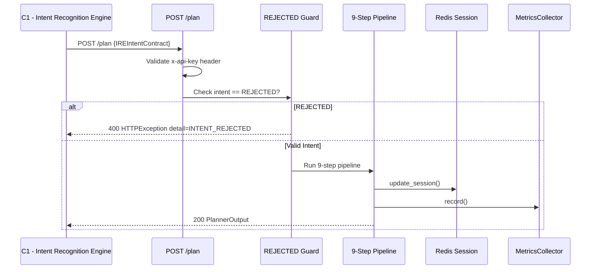

# 02 — API Reference

**Base URL:** `http://localhost:8002`  
**Authentication:** `x-api-key` header (value from `API_KEY` env var)

---

## 2.1 Endpoint Summary

| Method | Path | Auth | Description |
|---|---|---|---|
| `GET` | `/health` | None | Liveness + dependency status check |
| `POST` | `/plan` | `x-api-key` | Core command synthesis endpoint |
| `GET` | `/tools/available` | None | Lists supported tools and KB size |
| `GET` | `/metrics` | `x-api-key` | Returns aggregated request metrics |
| `POST` | `/kb/update` | `x-admin-key` | Dynamically updates knowledge base with document chunks |
| `POST` | `/admin/session/clear` | `x-admin-key` | Clears session context from Redis |
| `POST` | `/admin/metrics/reset` | `x-admin-key` | Resets in-memory metrics collector |
| `GET` | `/admin/status` | `x-admin-key` | Returns detailed administrative component status |

---

## 2.2 `GET /health`

Returns system status, including Redis connectivity and ChromaDB chunk count.

### Response

```json
{
  "status": "ok",
  "component": "C2-DynamicPlanner",
  "port": 8002,
  "redis": "ok",
  "kb_chunks": 412
}
```

| Field | Type | Description |
|---|---|---|
| `status` | `string` | Always `"ok"` if app started |
| `component` | `string` | Component identifier |
| `port` | `integer` | Listening port |
| `redis` | `string` | `"ok"` if Redis is reachable, else `"error"` |
| `kb_chunks` | `integer` | Number of document chunks in ChromaDB |

### Status Codes

| Code | Meaning |
|---|---|
| `200` | Application is running |

---

## 2.3 `POST /plan`

Main synthesis endpoint. Accepts a `PlanRequest` and returns a `PlannerOutput`.

### Request Headers

| Header | Required | Value |
|---|---|---|
| `x-api-key` | Yes | Value of `API_KEY` environment variable |
| `Content-Type` | Yes | `application/json` |

### Request Body — `PlanRequest`

The request supports two input formats:

**Format A — Enriched C1 format (preferred)**

```json
{
  "session_id": "sess-001",
  "intent": "NETWORK_SCAN",
  "target_type": "IP",
  "target_value": "192.168.1.100",
  "primary_tool": "nmap",
  "confidence": 0.97,
  "tool_parameters": {
    "flags": ["stealth"],
    "ports": [80, 443],
    "wordlist": null,
    "suggested_command": null
  }
}
```

**Format B — Legacy nested contract format**

```json
{
  "session_id": "sess-002",
  "intent_contract": {
    "intent": "VULNERABILITY_AUDIT",
    "target": { "type": "IP", "value": "10.0.0.5" },
    "ports": [443],
    "modifiers": ["ssl"],
    "cve_ids": [],
    "tool_hint": "nikto",
    "confidence": 0.95,
    "rejection_reason": null,
    "scope_warnings": []
  }
}
```

#### `PlanRequest` Field Reference

| Field | Type | Required | Description |
|---|---|---|---|
| `session_id` | `string` | **Yes** | Unique session identifier (used as Redis key suffix) |
| `intent_contract` | `IREIntentContract` | No | Legacy format: full nested contract object |
| `intent` | `string` | No* | Intent code (e.g., `NETWORK_SCAN`) |
| `sub_intent` | `string` | No | Secondary intent qualifier |
| `confidence` | `float` | No | Classification confidence from C1 (0.0–1.0) |
| `human_readable_intent` | `string` | No | Human-readable description (for logging) |
| `target_type` | `string` | No* | Target category: `IP`, `DOMAIN`, `URL` |
| `target_value` | `string` | No* | Actual target (e.g., `192.168.1.1`) |
| `target_in_scope` | `bool` | No | C1 scope confirmation flag |
| `primary_tool` | `string` | No | Preferred tool hint from C1 |
| `tool_parameters` | `ToolParameters` | No | Structured tool flags, ports, wordlist |
| `safety_notes` | `list[string]` | No | Warnings from C1 |
| `target` | `dict` | No | Legacy target object `{type, value}` |
| `ports` | `list[int]` | No | Legacy ports list |
| `modifiers` | `list[string]` | No | Legacy modifier flags |
| `cve_ids` | `list[string]` | No | CVE identifiers for exploitation intents |
| `tool_hint` | `string` | No | Legacy tool hint |
| `schedule` | `string` | No | Scheduling hint (informational) |
| `rejection_reason` | `string` | No | Populated if intent is `REJECTED` |
| `scope_warnings` | `list[string]` | No | Out-of-scope warnings from C1 |

> \* Required when `intent_contract` is not provided.

---

### Response Body — `PlannerOutput`

```json
{
  "status": "success",
  "command": "nmap -sS -p 80,443 192.168.1.100",
  "command_sequence": ["nmap -sS -p 80,443 192.168.1.100"],
  "tool": "nmap",
  "session_id": "sess-001",
  "intent_ref": "NETWORK_SCAN",
  "estimated_duration": "medium",
  "retrieval_sources": ["nmap", "nmap"],
  "validation_passed": true,
  "safety_flags": [],
  "latency_ms": 3214
}
```

#### `PlannerOutput` Field Reference

| Field | Type | Description |
|---|---|---|
| `status` | `"success"` or `"error"` | Overall result status |
| `command` | `string` | The synthesized bash command |
| `command_sequence` | `list[string]` | Always `[command]` in v1.0 (single element); reserved for future multi-step support |

| `tool` | `string` | Resolved tool name (e.g., `nmap`, `nikto`, `gobuster`) |
| `session_id` | `string` | Echo of the input session ID |
| `intent_ref` | `string` | Echo of the resolved intent |
| `estimated_duration` | `string` | Always `"medium"` in v1.0 |
| `retrieval_sources` | `list[string]` | Tool names from retrieved RAG documents |
| `validation_passed` | `bool` | Whether `CommandValidator` passed without fatal errors |
| `safety_flags` | `list[string]` | Any warnings from `SafetyFilter` |
| `latency_ms` | `integer` | End-to-end request processing time in milliseconds |

---

### Error Responses

**401 — Invalid API Key**
```json
{ "detail": "Invalid API key" }
```

**400 — Intent Rejected (from C1)**

FastAPI raises `HTTPException(status_code=400)` with a structured `detail` dict:
```json
{
  "detail": {
    "status": "error",
    "stage": "intent_filter",
    "error": "INTENT_REJECTED",
    "detail": "Intent was classified as REJECTED by C1. No plan can be generated.",
    "latency_ms": 12
  }
}

**400 — Safety Check Failed**
```json
{ "detail": "Safety check failed: ['BLOCKED: target 8.8.8.8 is not RFC-1918 private range']" }
```

**422 — Structural Command Validation Failed**

FastAPI raises `HTTPException(status_code=422)` when synthesized command fails structural validation:
```json
{
  "detail": {
    "status": "error",
    "stage": "command_validator",
    "error": "VALIDATION_FAILED",
    "detail": "Command structural validation failed: ['ERROR: command does not start with expected tool nmap']",
    "latency_ms": 3214
  }
}
```

**500 — Internal Error**
```json
{ "detail": "<exception message>" }
```


---

## 2.4 `GET /tools/available`

Returns the list of supported tools and current KB chunk count.

### Response

```json
{
  "tools": ["nmap", "nikto", "gobuster"],
  "kb_chunks": 412
}
```

---

## 2.5 `GET /metrics`

Returns aggregated metrics for all processed requests since the server started.

### Request Headers

| Header | Required | Value |
|---|---|---|
| `x-api-key` | Yes | `API_KEY` environment value |

### Response

```json
{
  "total": 42,
  "successful": 39,
  "failed": 3,
  "avg_latency_ms": 3108
}
```

| Field | Description |
|---|---|
| `total` | Total number of `/plan` requests processed |
| `successful` | Requests that returned `status: success` |
| `failed` | Requests that failed safety, validation, or raised exceptions |
| `avg_latency_ms` | Average end-to-end latency across all requests |

---

## 2.6 Request Flow Diagram



---

## 2.7 Administrative Endpoints

Administrative endpoints require authentication validating against `ADMIN_KEY` passed via the `x-admin-key` header (or `x-api-key` header matching `ADMIN_KEY`).

### 2.7.1 `POST /kb/update`

Dynamically ingests documentation chunks into the ChromaDB vector database using `KBUpdateRequest`.

**Headers:**
`x-admin-key`: `<ADMIN_KEY>`

**Request Body:**
```json
{
  "content": "Custom tool documentation for security testing...",
  "metadata": { "tool": "nmap" }
}
```

**Response:**
```json
{
  "status": "success",
  "chunks_added": 2,
  "kb_chunks": 414
}
```

### 2.7.2 `POST /admin/session/clear`

Clears stored session state from Redis for a given `session_id`.

**Headers:**
`x-admin-key`: `<ADMIN_KEY>`

**Query Parameters:**
- `session_id`: Session ID to clear

**Response:**
```json
{
  "status": "success",
  "session_id": "sess-001",
  "message": "Session context cleared successfully"
}
```

### 2.7.3 `POST /admin/metrics/reset`

Resets the in-memory metrics collector stats.

**Headers:**
`x-admin-key`: `<ADMIN_KEY>`

**Response:**
```json
{
  "status": "success",
  "message": "Metrics reset successfully"
}
```

### 2.7.4 `GET /admin/status`

Returns system status and detailed metrics summary for administrative diagnostics.

**Headers:**
`x-admin-key`: `<ADMIN_KEY>`

**Response:**
```json
{
  "status": "ok",
  "component": "C2-DynamicPlanner",
  "admin_authenticated": true,
  "redis": "ok",
  "kb_chunks": 414,
  "metrics_summary": {
    "total": 42,
    "successful": 39,
    "failed": 3,
    "avg_latency_ms": 3108
  }
}
```
