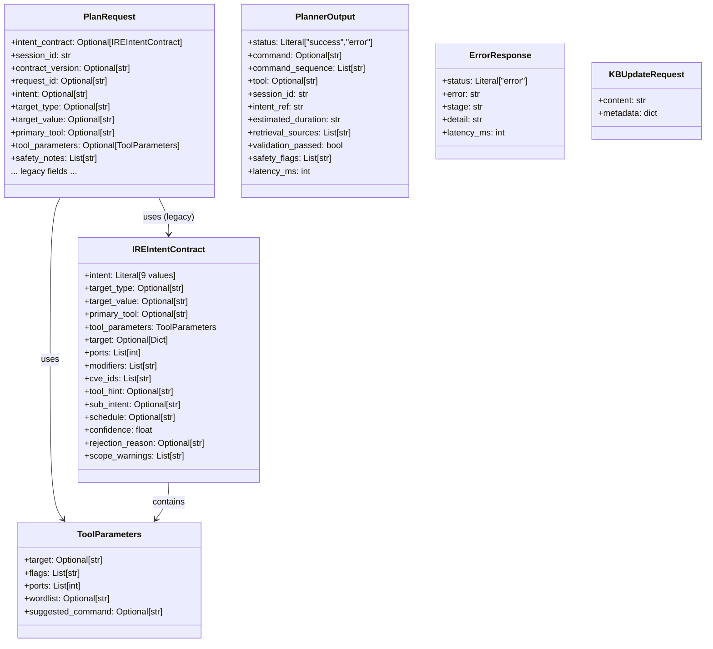
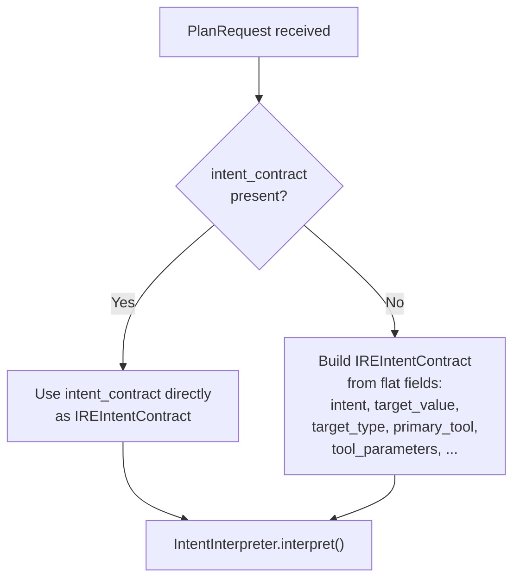

# 03 — Data Models

All models are defined in [`src/schemas/models.py`](../src/schemas/models.py) using **Pydantic v2**.

---

## 3.1 Model Hierarchy

---

## 3.2 `ToolParameters`

Structured tool configuration sent from C1 in the enriched format.

| Field | Type | Default | Description |
|---|---|---|---|
| `target` | `Optional[str]` | `None` | Raw target string (if set by C1) |
| `flags` | `List[str]` | `[]` | Tool modifier flags (e.g., `["stealth", "ssl"]`) |
| `ports` | `List[int]` | `[]` | Port numbers to scan/target |
| `wordlist` | `Optional[str]` | `None` | Wordlist path for gobuster/hydra (e.g., `"common"`, `"medium"`) |
| `suggested_command` | `Optional[str]` | `None` | Optional pre-formed command hint from C1 |

---

## 3.3 `IREIntentContract`

The primary inter-component contract produced by C1 and consumed by C2.

### Intent Literal Values

| Intent Code | Meaning | Primary Tool |
|---|---|---|
| `NETWORK_SCAN` | Port scan of a network target | nmap |
| `SERVICE_ENUMERATION` | Enumerate running services and versions | nmap |
| `VULNERABILITY_AUDIT` | Web vulnerability scanning | nikto |
| `DIRECTORY_BRUTEFORCE` | Enumerate hidden web directories | gobuster |
| `EXPLOITATION` | Exploit known CVEs | metasploit |
| `PASSWORD_ATTACK` | Brute-force authentication | hydra |
| `PASSIVE_RECON` | OSINT / DNS reconnaissance | whois, dig |
| `AMBIGUOUS` | C1 could not classify confidently | — |
| `REJECTED` | C1 explicitly blocked this intent | — |

### Field Reference

| Field | Type | Format | Description |
|---|---|---|---|
| `intent` | `Literal[...]` | See table above | Primary intent code |
| `target_type` | `Optional[str]` | `IP`, `DOMAIN`, `URL` | Target classification |
| `target_value` | `Optional[str]` | `192.168.1.1` | Actual target address/domain |
| `primary_tool` | `Optional[str]` | `nmap`, `nikto`, etc. | Recommended tool from C1 |
| `tool_parameters` | `ToolParameters` | Object | Enriched tool config (C1 v2 format) |
| `target` | `Optional[Dict]` | `{"type": "IP", "value": "..."}` | Legacy target dict (C1 v1 format) |
| `ports` | `List[int]` | `[80, 443]` | Legacy ports list |
| `modifiers` | `List[str]` | `["stealth", "ssl"]` | Legacy modifier flags |
| `cve_ids` | `List[str]` | `["CVE-2021-44228"]` | CVE IDs for exploitation planning |
| `tool_hint` | `Optional[str]` | `nmap` | Legacy tool hint |
| `sub_intent` | `Optional[str]` | — | Secondary intent qualifier |
| `schedule` | `Optional[str]` | — | Scheduling hint (informational only) |
| `confidence` | `float` | `0.0`–`1.0` | C1 classification confidence score |
| `rejection_reason` | `Optional[str]` | — | Reason for rejection (if `intent == REJECTED`) |
| `scope_warnings` | `List[str]` | — | Out-of-scope warnings from C1 |

---

## 3.4 `PlanRequest`

The HTTP request body schema for `POST /plan`. Supports both enriched (C1 v2) and legacy (C1 v1) formats.

> **C2 compatibility policy:** If `intent_contract` is present, it takes priority. Otherwise, C2 constructs an `IREIntentContract` from the flat fields.

| Field | Type | Notes |
|---|---|---|
| `session_id` | `str` | **Required.** Used as Redis key: `session:{session_id}` |
| `intent_contract` | `Optional[IREIntentContract]` | Legacy nested contract |
| `contract_version` | `Optional[str]` | Version identifier (informational) |
| `request_id` | `Optional[str]` | Idempotency key (informational) |
| `intent` | `Optional[str]` | Direct intent code |
| `sub_intent` | `Optional[str]` | Sub-classification |
| `confidence` | `Optional[float]` | C1 confidence |
| `human_readable_intent` | `Optional[str]` | Descriptive intent text |
| `target_type` | `Optional[str]` | `IP` / `DOMAIN` / `URL` |
| `target_value` | `Optional[str]` | Target address |
| `target_in_scope` | `Optional[bool]` | C1 scope confirmation |
| `primary_tool` | `Optional[str]` | Preferred tool |
| `tool_parameters` | `Optional[ToolParameters]` | Structured tool params |
| `safety_notes` | `List[str]` | Safety context from C1 |
| `target` | `Optional[Dict]` | Legacy: `{type, value}` dict |
| `ports` | `List[int]` | Legacy port list |
| `modifiers` | `List[str]` | Legacy modifiers |
| `cve_ids` | `List[str]` | CVE identifiers |
| `tool_hint` | `Optional[str]` | Legacy tool hint |
| `schedule` | `Optional[str]` | Scheduling hint |
| `rejection_reason` | `Optional[str]` | Rejection message |
| `scope_warnings` | `List[str]` | Scope warnings |

---

## 3.5 `PlannerOutput`

The HTTP response schema for successful `POST /plan` calls.

| Field | Type | Description |
|---|---|---|
| `status` | `Literal["success", "error"]` | Result status |
| `command` | `Optional[str]` | The final synthesized bash command |
| `command_sequence` | `List[str]` | List wrapping the command (extensible for multi-step) |
| `tool` | `Optional[str]` | Resolved tool name |
| `session_id` | `str` | Session identifier |
| `intent_ref` | `str` | The processed intent code |
| `estimated_duration` | `str` | Always `"medium"` in v1.0 |
| `retrieval_sources` | `List[str]` | Tool names of retrieved RAG documents |
| `validation_passed` | `bool` | `True` if `CommandValidator` passed |
| `safety_flags` | `List[str]` | Safety warnings (non-fatal) or empty list |
| `latency_ms` | `int` | Total processing latency in ms |

---

## 3.6 `ErrorResponse`

Used for structured error reporting.

| Field | Type | Description |
|---|---|---|
| `status` | `Literal["error"]` | Always `"error"` |
| `error` | `str` | Error code (e.g., `INTENT_REJECTED`) |
| `stage` | `str` | Pipeline stage where error occurred (e.g., `intent_filter`) |
| `detail` | `str` | Human-readable error message |
| `latency_ms` | `int` | Latency up to the point of failure |

---

## 3.7 `KBUpdateRequest`

> **Status: Reserved.** This schema is defined in `src/schemas/models.py` but **no endpoint** in v1.0 accepts or processes it. It is imported in `main.py` but unused. It represents the intended interface for a future knowledge-base update endpoint.

| Field | Type | Constraints | Description |
|---|---|---|---|
| `content` | `str` | `max_length=51200` | Document text content |
| `metadata` | `dict` | — | Tool name, source, etc. |

---

## 3.8 Format Compatibility Matrix

---

## 3.9 Passthrough-Only Fields (v1.0)

The following fields are extracted into the `params` dict by `IntentInterpreter` but are **not consumed** by any downstream module in the current implementation:

| Field | Extracted by | Would be used by | Current status |
|---|---|---|---|
| `suggested_command` | `IntentInterpreter` | `ContextAssembler` or `CommandSynthesizer` | **Not used** — present in `params` dict but neither assembler nor synthesizer reads it |
| `multi_step` | `IntentInterpreter` | `main.py` pipeline branching | **Not acted upon** — computed but `main.py` always generates a single command regardless |
