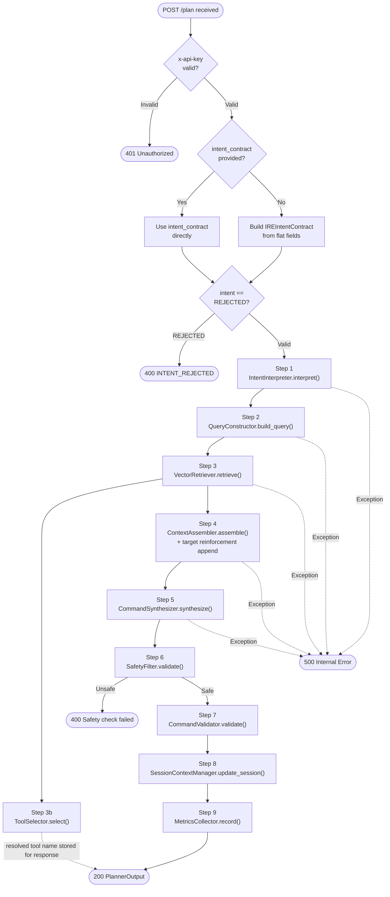
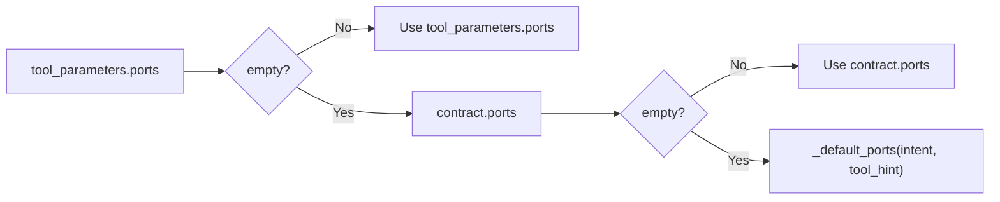
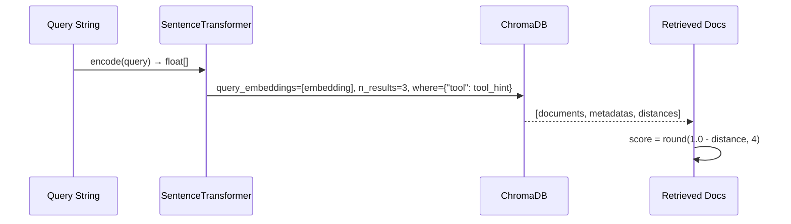
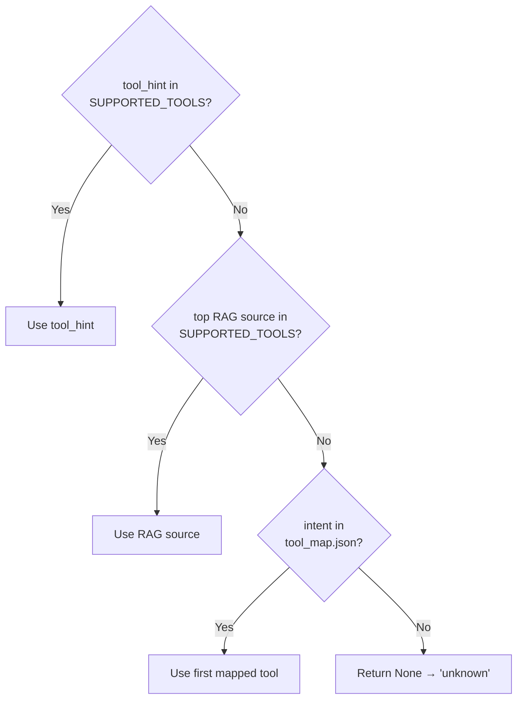
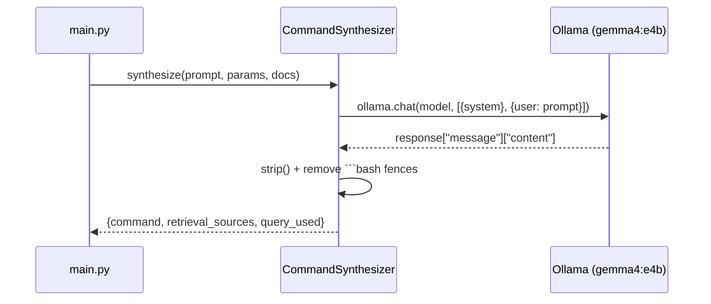
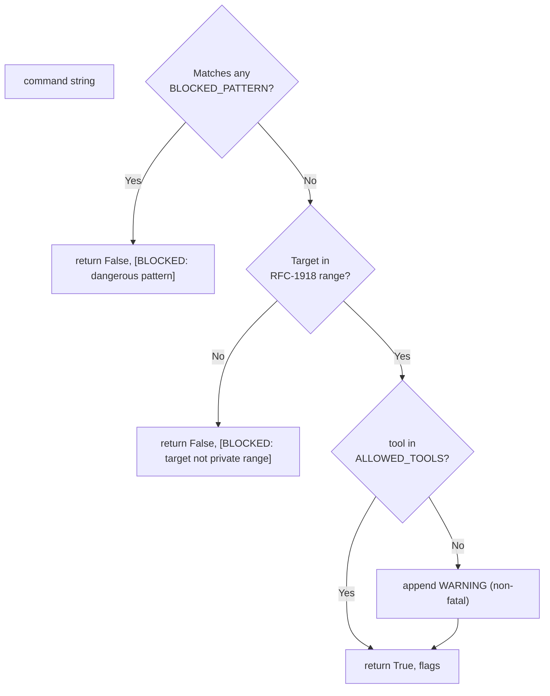

# 04 — Pipeline Flow

This document describes the complete request lifecycle inside the `POST /plan` endpoint, from receipt to response.

---

## 4.1 Pipeline Overview

Every valid, non-rejected request passes through nine sequential steps:



> **Note on Step 3b:** `ToolSelector.select()` runs in parallel with `ContextAssembler.assemble()` (both use the Step 3 output), but `ToolSelector`'s result (the resolved tool name) is **not passed into `CommandSynthesizer`** — it is stored in the local `tool` variable and placed directly in the `PlannerOutput` response. `CommandSynthesizer` receives the prompt, params dict, and docs only.

---

## 4.2 Step-by-Step Detail

### Step 1 — Intent Interpretation

**Module:** `src/intent/intent_interpreter.py` → `IntentInterpreter.interpret()`

Converts the `IREIntentContract` into a flat `params` dictionary consumed by all downstream steps.

**Input:** `IREIntentContract`

**Output dict keys:**

| Key | Source | Description |
|---|---|---|
| `intent` | `contract.intent` | Intent code string |
| `target_value` | `contract.target_value` or `contract.target["value"]` | Resolved target address |
| `target_type` | `contract.target_type` or `contract.target["type"]` | IP / DOMAIN / URL |
| `ports` | `tool_parameters.ports` → `contract.ports` → `_default_ports()` | Port list (priority resolution) |
| `modifiers` | `tool_parameters.flags` → `contract.modifiers` | Flag list |
| `cve_ids` | `contract.cve_ids` | CVE identifiers |
| `tool_hint` | `contract.primary_tool` → `contract.tool_hint` | Tool hint (priority resolution) |
| `confidence` | `contract.confidence` | Float 0.0–1.0 |
| `wordlist` | `tool_parameters.wordlist` | Wordlist path if present |
| `suggested_command` | `tool_parameters.suggested_command` | Pre-formed command hint |
| `multi_step` | Intent ∈ {`EXPLOITATION`, `VULNERABILITY_AUDIT`} AND `confidence > 0.85` | Computed flag — passed to `CommandSynthesizer` for multi-command sequence generation |

**Port resolution priority:**


**Default ports by intent/tool:**

| Condition | Default Ports |
|---|---|
| `tool_hint == "nikto"` OR `intent == "VULNERABILITY_AUDIT"` | `[80]` |
| `intent == "DIRECTORY_BRUTEFORCE"` | `[80]` |
| All others | `[]` |

> **`multi_step` note:** When `multi_step` is `True`, `CommandSynthesizer.parse_command_output()` extracts an ordered list of up to 5 commands into `command_sequence`. Every command in the sequence is independently validated via `SafetyFilter` and `CommandValidator`. The first command (`command_sequence[0]`) is populated in `command` for backward compatibility.

---

### Step 2 — Query Construction

**Module:** `src/intent/query_constructor.py` → `QueryConstructor.build_query()`

Converts `params` into a semantic query string for ChromaDB retrieval.

**Template mapping:**

| Intent | Query Template |
|---|---|
| `NETWORK_SCAN` | `nmap {modifiers} network port scan syntax flags {target_type}` |
| `SERVICE_ENUMERATION` | `nmap service version detection banner grabbing {modifiers}` |
| `VULNERABILITY_AUDIT` | `nikto web vulnerability scan {modifiers} {target_type} port {ports}` |
| `DIRECTORY_BRUTEFORCE` | `gobuster directory enumeration wordlist {modifiers} {target_type}` |
| `EXPLOITATION` | `metasploit exploit command syntax required options payload {cve}` |
| `PASSWORD_ATTACK` | `hydra brute force {target_type} command syntax` |
| `PASSIVE_RECON` | `whois DNS reconnaissance OSINT command syntax` |
| (default) | `security tool command syntax {modifiers} {target_type}` |

**Modifier expansion** (selection of `MODIFIER_TEXT_MAP`):

| Modifier Key | Expanded Text |
|---|---|
| `stealth` | `SYN stealth scan half-open technique` |
| `aggressive` | `aggressive scan OS detection version detection all ports` |
| `all-ports` | `scan all 65535 ports complete port range` |
| `quick` | `fast scan top 100 common ports timing` |
| `ssl` | `HTTPS SSL TLS certificate secure connection port 443` |
| `evasion` | `IDS evasion technique bypass detection encoding` |
| `dns` | `DNS subdomain enumeration domain brute force` |
| `vhost` | `virtual host enumeration vhost mode` |

---

### Step 3 — Vector Retrieval

**Module:** `src/rag/vector_retriever.py` → `VectorRetriever.retrieve()`

Embeds the query using `all-MiniLM-L6-v2` and performs a cosine similarity search in ChromaDB.



**Retrieved doc structure:**
```json
{
  "content": "TOOL: nmap\n-sS SYN stealth scan...",
  "tool": "nmap",
  "score": 0.8821
}
```

> When `tool_hint` is provided, retrieval is filtered to only that tool's chunks. If no `tool_hint`, all tools are searched.

---

### Step 3b — Tool Selection

**Module:** `src/synthesis/tool_selector.py` → `ToolSelector.select()`

Resolves the definitive tool name using a priority chain:



**Supported tools set:** `{nmap, nikto, gobuster}`

**`tool_map.json` fallbacks:**

| Intent | Fallback Tool |
|---|---|
| `NETWORK_SCAN` | `nmap` |
| `SERVICE_ENUMERATION` | `nmap` |
| `VULNERABILITY_AUDIT` | `nikto` |
| `DIRECTORY_BRUTEFORCE` | `gobuster` |
| `EXPLOITATION` | (none) |
| `PASSWORD_ATTACK` | (none) |
| `PASSIVE_RECON` | (none) |

---

### Step 4 — Context Assembly

**Module:** `src/rag/context_assembler.py` → `ContextAssembler.assemble()`

Groups retrieved docs by tool, formats documentation sections, and constructs the LLM prompt.

**Prompt structure:**
```
You are a Kali Linux penetration testing command expert.
Your job is to generate ONE syntactically correct bash command...

INTENT: <intent>
TARGET: <target_value>
PORTS: <ports>
MODIFIERS: <modifiers>

TOOL DOCUMENTATION:
=== NMAP DOCUMENTATION ===
<chunk content>

RULES:
1. Output ONLY the bash command - no explanation...
2. Use ONLY flags and options shown in the documentation above
3. Replace placeholder IPs with the actual target
4. If ports are specified, include them in the command

COMMAND:

[Appended by main.py]:
IMPORTANT:
Use this exact target in the command: <target_value>
Output ONLY one command.
```

---

### Step 5 — Command Synthesis

**Module:** `src/synthesis/command_synthesizer.py` → `CommandSynthesizer.synthesize()`

Calls Ollama with the assembled prompt.



**System prompt:** `"You are a Kali Linux command generator. Output ONLY a valid command. Do not explain."`

**Post-processing:** Strips markdown fences (` ```bash ` / ` ``` `) from LLM output.

---

### Step 6 — Safety Validation

**Module:** `src/validation/safety_filter.py` → `SafetyFilter.validate()`

Runs three sequential checks:



**Blocked patterns include:** `rm -rf`, `mkfs`, `dd if=`, fork bomb, `chmod 777 /`, write to `/dev/sd*`, `wget|bash`, `curl|bash`, `nc -e /bin`, `bash -i >&`

**Allowed target ranges:** RFC-1918 (`192.168.x.x`, `10.x.x.x`, `172.16-31.x.x`), `127.x.x.x`, `localhost`

---

### Step 1 — Intent Interpretation & Target Recovery

**Module:** `src/intent/intent_interpreter.py` → `IntentInterpreter.interpret()`

Converts the `IREIntentContract` into a flat `params` dictionary consumed by all downstream steps.

If `target_value` is missing, empty, or `"UNKNOWN"`, `main.py` invokes `session_mgr.get_last_target(session_id)` to recover the last valid target seen in the session. Valid targets supplied by C1 are never overwritten.

---

### Step 3 — Vector Retrieval & Score Thresholding

**Module:** `src/rag/vector_retriever.py` → `VectorRetriever.retrieve()`

Embeds the query using `all-MiniLM-L6-v2`, performs a cosine similarity search in ChromaDB, and filters out retrieved chunks below the relevance score threshold (`score_threshold = 0.30` default, configurable via `RAG_SCORE_THRESHOLD`).

---

### Step 7 — Command Validation & Enforcement

**Module:** `src/validation/command_validator.py` → `CommandValidator.validate()`

Structural validation against the expected tool. If `validator.validate()` returns `valid = False` due to fatal structural issues (empty command, multi-line command, or tool binary prefix mismatch), `main.py` records metrics with `success = False` and raises `HTTPException(status_code=422)` (Unprocessable Entity).

---

### Step 8 — Session Update & Graceful Degradation

**Module:** `src/session/session_context_manager.py` → `SessionContextManager.update_session()`

Appends the command, tool, and target to the Redis session object (TTL: 3600 seconds). If Redis is unreachable or connection fails, `SessionContextManager` catches `redis.RedisError`, logs a warning, and gracefully persists session state to `self._memory_fallback` dictionary store so synthesis requests continue without HTTP 500 errors.


---

### Step 9 — Metrics Recording

**Module:** `src/utils/metrics_collector.py` → `MetricsCollector.record()`

Records session ID, intent, tool, latency, success flag, and safety flags into the in-memory metrics list. Returns the `latency_ms` value used in `PlannerOutput`.
