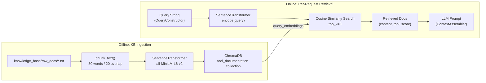
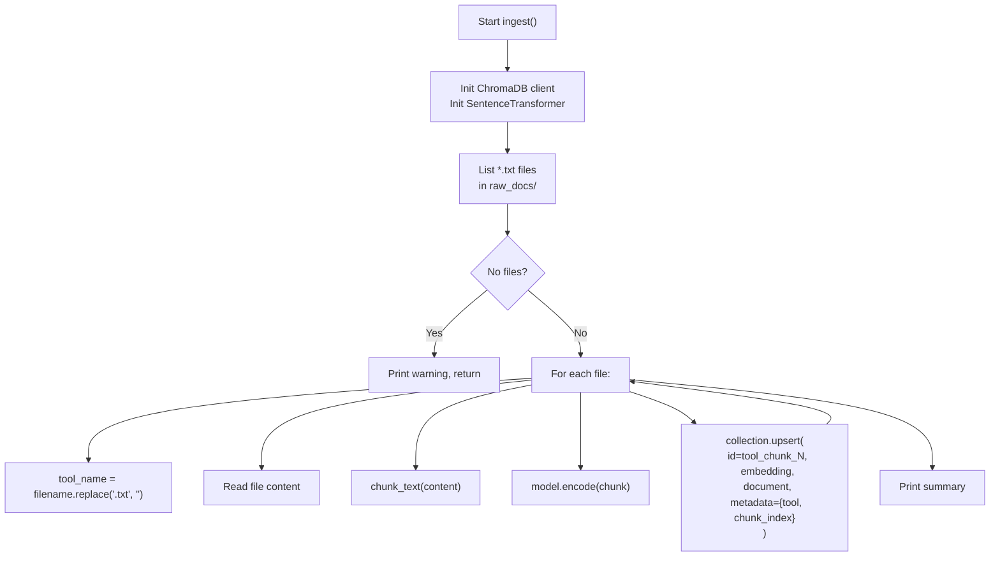
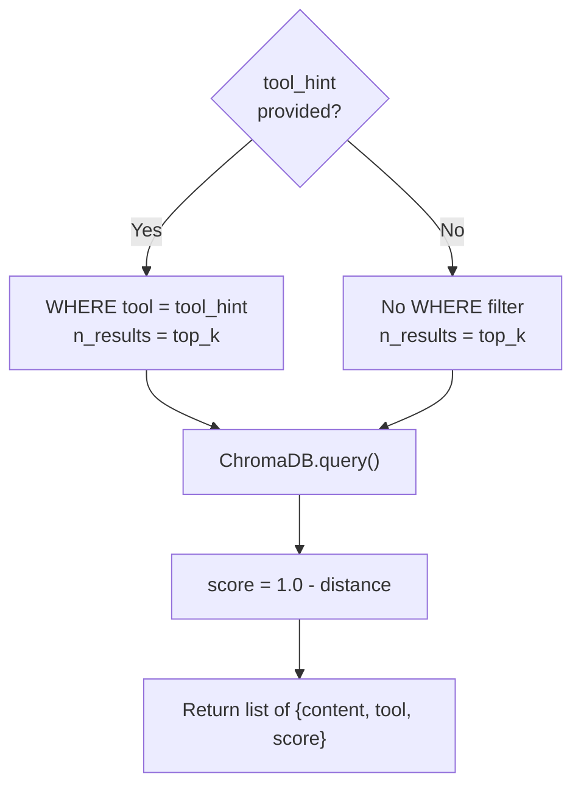

# 06 — RAG Subsystem

The **Retrieval-Augmented Generation (RAG)** subsystem grounds all LLM outputs in documented tool behavior, preventing hallucinated flags or invalid syntax.

---

## 6.1 Architecture Overview



---

## 6.2 Knowledge Base Ingestion (`scripts/ingest_docs.py`)

### Purpose

Reads raw `.txt` documentation files from `knowledge_base/raw_docs/`, chunks and embeds them, and upserts into ChromaDB.

### `chunk_text(text, chunk_size=80, overlap=20) → list[str]`

Splits text into overlapping word-level chunks.

| Parameter | Default | Description |
|---|---|---|
| `chunk_size` | `80` | Number of words per chunk |
| `overlap` | `20` | Overlap in words between consecutive chunks |

**Example:**
```
Text: "word1 word2 ... word100"
Chunk 0: words 0..79   (80 words)
Chunk 1: words 60..139 (80 words, 20-word overlap with chunk 0)
Chunk 2: words 120..199 ...
```

The 20-word overlap ensures that sentences spanning chunk boundaries are represented in at least one complete chunk.

### `ingest() → None`

**Algorithm:**



**Document ID format:** `{tool_name}_chunk_{i}` (e.g., `nmap_chunk_0`)

**Metadata per chunk:**
```json
{
  "tool": "nmap",
  "chunk_index": 0
}
```

### Raw Documentation Format

Place plain text files in `knowledge_base/raw_docs/`. The filename (without `.txt`) becomes the tool name in metadata.

```
knowledge_base/
└── raw_docs/
    ├── nmap.txt
    ├── nikto.txt
    └── gobuster.txt
```

**Recommended content structure per file:**
```
TOOL: nmap
DESCRIPTION: Network exploration tool and security auditor

FLAG: -sS
DESCRIPTION: SYN stealth scan (half-open)
SYNTAX: nmap -sS <target>
EXAMPLE: nmap -sS 192.168.1.1

FLAG: -sV
DESCRIPTION: Version detection
...
```

---

## 6.3 Vector Store (ChromaDB)

### Collection: `tool_documentation`

| Setting | Value |
|---|---|
| Distance metric | Cosine (`hnsw:space: cosine`) |
| Persistence path | `knowledge_base/chroma_db/` |
| Client type | `PersistentClient` |

### Document Schema

| Field | Type | Description |
|---|---|---|
| `id` | `str` | Unique chunk ID (e.g., `nmap_chunk_5`) |
| `embedding` | `float[]` | 384-dimensional vector from `all-MiniLM-L6-v2` |
| `document` | `str` | Raw chunk text |
| `metadata.tool` | `str` | Source tool name |
| `metadata.chunk_index` | `int` | Chunk ordinal within the source file |

---

## 6.4 Embedding Model

**Model:** `sentence-transformers/all-MiniLM-L6-v2`

| Property | Value |
|---|---|
| Embedding dimensions | 384 |
| Max input tokens | 256 |
| Distance metric used | Cosine |
| Download location | `~/.cache/huggingface/hub/` (auto-downloaded) |

The same model instance is used for both ingestion (offline) and retrieval (online). This ensures embedding consistency.

---

## 6.5 Retrieval Logic

### Tool-Filtered vs. Open Retrieval



### Score Interpretation & Threshold Filtering

The `score` field (`1.0 - cosine_distance`) is calculated for each retrieved chunk. `VectorRetriever` enforces a default score threshold of `0.30` (configurable via `score_threshold` argument or `RAG_SCORE_THRESHOLD` environment variable). Any retrieved chunks with a similarity score below `0.30` are filtered out before prompt context assembly.

| Score Range | Quality Category | Action |
|---|---|---|
| `0.90 – 1.00` | Near-exact match | Included |
| `0.75 – 0.89` | Strong semantic match | Included |
| `0.30 – 0.74` | Moderate match | Included |
| `< 0.30` | Weak relevance | Filtered out |


---

## 6.6 Adding New Tools to the KB

1. Create a new `.txt` file in `knowledge_base/raw_docs/` named `<toolname>.txt`.
2. Populate with structured documentation (flags, syntax, examples).
3. Add the tool to `SUPPORTED_TOOLS` in `src/synthesis/tool_selector.py`.
4. Add intent → tool mapping to `data/tool_map.json` if needed.
5. Add the tool's query template to `QUERY_TEMPLATES` in `src/intent/query_constructor.py`.
6. Add validation config to `TOOL_REQUIRED_FLAGS` and `TOOL_PATTERNS` in `src/validation/command_validator.py`.
7. Re-run ingestion:
   ```bash
   python scripts/ingest_docs.py
   ```
8. Verify chunk count:
   ```bash
   curl http://localhost:8002/health
   ```
