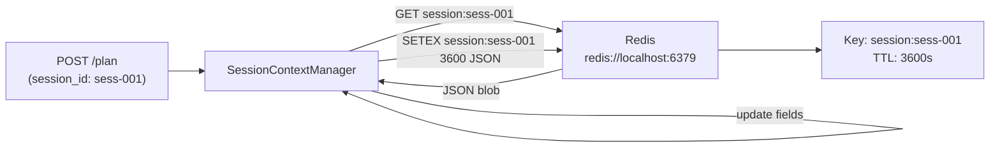
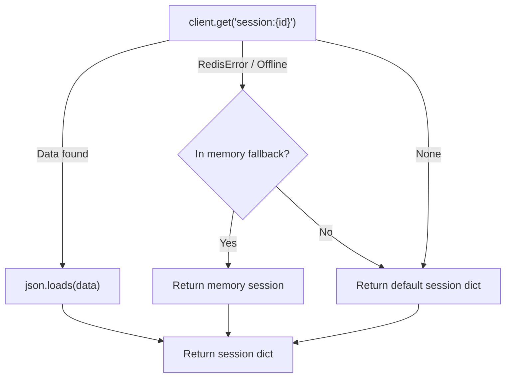

# 08 — Session Management

## 8.1 Overview

C2 maintains per-session state in **Redis**, enabling context tracking across multiple planning requests within the same penetration testing engagement session.

---

## 8.2 Architecture



---

## 8.3 Session Schema

Sessions are stored as JSON strings under the key `session:{session_id}` with a 3600-second (1-hour) TTL.

```json
{
  "session_id": "sess-001",
  "targets_seen": [
    "192.168.1.1",
    "10.0.0.5"
  ],
  "commands_run": [
    "nmap -sS 192.168.1.1",
    "nikto -h 10.0.0.5 -p 80"
  ],
  "tools_used": [
    "nmap",
    "nikto"
  ],
  "created_at": "2026-08-24T07:00:00.000000",
  "last_updated": "2026-08-24T07:12:34.000000"
}
```

### Field Reference

| Field | Type | Behaviour |
|---|---|---|
| `session_id` | `string` | Echo of the session identifier |
| `targets_seen` | `list[string]` | Deduplicated list of all targets for this session |
| `commands_run` | `list[string]` | Ordered list of every command generated (not deduplicated) |
| `tools_used` | `list[string]` | Deduplicated list of tools invoked |
| `created_at` | `string (ISO 8601)` | Set on first request, never overwritten |
| `last_updated` | `string (ISO 8601)` | Updated on every request |

---

## 8.4 `SessionContextManager` API & Resiliency

### `get_last_target(session_id: str) → str | None`

Extracts the most recent valid target seen in the session (`targets_seen`). Excludes empty strings and `"UNKNOWN"`. Used by `main.py` for target recovery when an incoming request lacks a valid target IP/domain.

### `get_session(session_id: str) → dict`

Retrieves the session from Redis (or `self._memory_fallback` if Redis is offline). If the key does not exist in Redis or memory, returns a **fresh default session object**.



### `update_session(session_id, command, tool, target)`

Updates and persists the session to Redis and `self._memory_fallback`. If Redis connection fails, `SessionContextManager` catches `redis.RedisError`, logs a warning, and retains session state in memory so synthesis requests continue uninterrupted.

### `clear_session(session_id: str)`

Deletes `session:{session_id}` from Redis and `self._memory_fallback`.


---

## 8.5 TTL Behaviour

| Event | Effect on TTL |
|---|---|
| New `update_session()` call | TTL **reset** to 3600 seconds |
| No activity for 3600 seconds | Key **auto-expires**; next request gets a fresh default session |
| `clear_session()` | Key **deleted** immediately |

The TTL is a sliding expiry — each update resets the countdown.

---

## 8.6 Configuration

| Environment Variable | Default | Description |
|---|---|---|
| `REDIS_URL` | `redis://localhost:6379` | Redis connection URL |

The `SESSION_TTL` constant is hardcoded at `3600` seconds in `session_context_manager.py`.

---

## 8.7 Session Isolation

Each session ID forms an independent namespace. Sessions do not share state. The session ID is chosen by the caller (C1 or the client application). It is recommended to use a UUID:

```python
import uuid
session_id = str(uuid.uuid4())
# e.g. "a1b2c3d4-e5f6-7890-abcd-ef1234567890"
```

---

## 8.8 Diagnostics

### Check Redis Connectivity

```bash
# Check from health endpoint
curl http://localhost:8002/health
# {"redis": "ok", ...}

# Check directly
redis-cli ping
# PONG
```

### Inspect a Session

```bash
redis-cli get "session:sess-001"
```

### Count Active Sessions

```bash
redis-cli keys "session:*" | wc -l
```

### Clear All Sessions (Development Only)

```bash
redis-cli keys "session:*" | xargs redis-cli del
```
