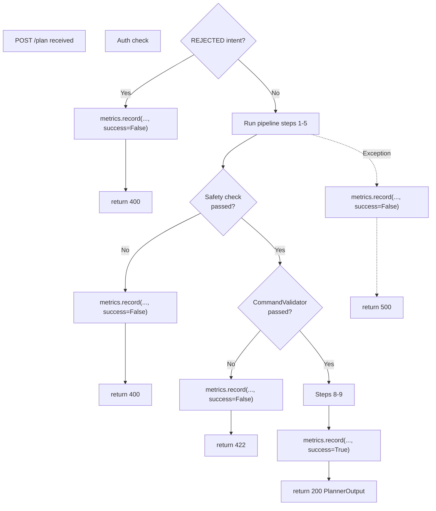

# 09 — Metrics & Observability

## 9.1 Overview

C2 includes a lightweight **in-memory metrics collector** that tracks every `/plan` request. Metrics are available via the authenticated `GET /metrics` endpoint.

> ⚠️ Metrics are in-memory only. They reset on every server restart. For persistent metrics, integrate a time-series database (e.g., Prometheus, InfluxDB).

---

## 9.2 MetricsCollector

**Module:** `src/utils/metrics_collector.py`

### Internal Storage

```python
self.metrics = []  # List of metric entry dicts
```

### Entry Schema

Each call to `record()` appends one entry:

```json
{
  "timestamp"   : "2026-08-24T07:00:00.000000",
  "session_id"  : "sess-001",
  "intent"      : "NETWORK_SCAN",
  "tool"        : "nmap",
  "latency_ms"  : 3214,
  "success"     : true,
  "safety_flags": []
}
```

| Field | Type | Description |
|---|---|---|
| `timestamp` | `string` | UTC ISO-8601 timestamp when `record()` was called |
| `session_id` | `string` | Session identifier from the request |
| `intent` | `string` | Resolved intent code |
| `tool` | `string` | Tool selected by `ToolSelector` |
| `latency_ms` | `int` | End-to-end request latency in milliseconds |
| `success` | `bool` | `True` if pipeline completed without error; `False` if safety/validation failed or exception was raised |
| `safety_flags` | `list[string]` | Any warnings or blocks from `SafetyFilter` |

---

## 9.3 API Endpoint

### `GET /metrics`

**Auth:** `x-api-key` header required.

```bash
curl -H "x-api-key: <your-api-key>" http://localhost:8002/metrics
```

**Response:**

```json
{
  "total": 42,
  "successful": 39,
  "failed": 3,
  "avg_latency_ms": 3108
}
```

| Field | Description |
|---|---|
| `total` | Total number of `record()` calls (includes rejected, failed, and successful) |
| `successful` | Count where `success == true` |
| `failed` | `total - successful` |
| `avg_latency_ms` | Integer average of all `latency_ms` values |

**Empty state response (no requests yet):**
```json
{ "total": 0 }
```

---

## 9.4 When Metrics are Recorded



Every code path through `POST /plan` records exactly **one metric entry**.


---

## 9.5 Latency Measurement

Latency is measured from the start of the `plan()` function (after auth) to the point of `metrics.record()`:

```python
start_time = time.time()
# ... pipeline execution ...
latency_ms = int((time.time() - start_time) * 1000)
```

This includes:
- Intent interpretation
- Query construction
- Vector retrieval (ChromaDB query)
- Context assembly
- LLM inference (Ollama — largest contributor)
- Safety validation
- Command validation
- Session update (Redis write)

> The **dominant latency factor** is Ollama LLM inference, typically 1–10 seconds depending on hardware and model quantization.

---

## 9.6 Extending Observability

### Option A — Prometheus Integration

Replace `MetricsCollector` with `prometheus_client` counters and histograms:

```python
from prometheus_client import Counter, Histogram, start_http_server

REQUEST_COUNT   = Counter("c2_requests_total", "Total requests", ["intent", "tool", "success"])
REQUEST_LATENCY = Histogram("c2_latency_ms", "Request latency", buckets=[100, 500, 1000, 3000, 10000])
```

### Option B — Structured Logging

Add structured JSON logging per request for log aggregation systems (ELK, Loki):

```python
import logging, json
logging.info(json.dumps({
    "event": "plan_complete",
    "session_id": session_id,
    "intent": contract.intent,
    "tool": tool,
    "latency_ms": latency,
    "success": True
}))
```

### Option C — Redis Persistence

Write metric entries to Redis sorted sets for cross-restart persistence:

```python
redis.zadd("metrics", {json.dumps(entry): time.time()})
```
