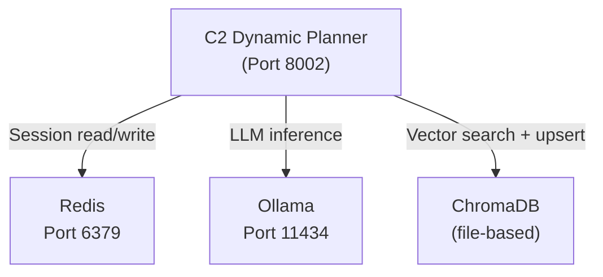
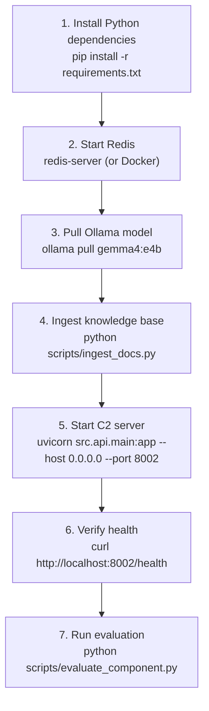

# 10 — Configuration & Deployment

## 10.1 Environment Variables

All configuration is loaded from `.env` via `python-dotenv`. The `.env` file should be placed in the project root.

### Reference Table

| Variable | Default (code fallback) | Read By | Description |
|---|---|---|---|
| `REDIS_URL` | `redis://localhost:6379` | `session_context_manager.py` | Full Redis connection URL (with graceful in-memory fallback) |
| `RAG_SCORE_THRESHOLD` | `0.30` | `vector_retriever.py` | Minimum relevance similarity score threshold for RAG document chunk retrieval |
| `CHROMA_DIR` | *(not read by code)* | *(not read)* | Listed in `.env` for reference; path computed via `os.path.dirname(__file__)` |
| `PORT` | *(not read by code)* | *(not read)* | Listed in `.env` for reference; set in launch command directly |
| `API_KEY` | *(configured in .env)* | `src/api/main.py` | Authenticates `/plan` and `/metrics` requests via `x-api-key` header |
| `ADMIN_KEY` | *(configured in .env)* | `src/api/main.py` | Authenticates `/kb/update`, `/admin/session/clear`, `/admin/metrics/reset`, `/admin/status` |
| `OLLAMA_MODEL` | `gemma4:e4b` | `command_synthesizer.py` | Ollama model name passed to `ollama.chat()` |
| `ANONYMIZED_TELEMETRY` | `False` | `ingest_docs.py` | Disables ChromaDB telemetry |


> **Security:** Never commit `.env` files containing real credentials to version control. Rotate the `API_KEY` before any deployment. The code fallback defaults are for local development only and must not be used in production.

### Example `.env` (structure only — replace all values)

```dotenv
REDIS_URL=redis://localhost:6379
CHROMA_DIR=./knowledge_base/chroma_db
PORT=8002
API_KEY=<your-secret-api-key>
ADMIN_KEY=<your-secret-admin-key>
OLLAMA_MODEL=gemma4:e4b
ANONYMIZED_TELEMETRY=False
```

---

## 10.2 Python Dependencies

```
fastapi==0.111.0
uvicorn==0.29.0
pydantic==2.7.1
ollama==0.2.0
chromadb==0.5.0
sentence-transformers==3.0.0
langchain==0.2.0
langchain-community==0.2.0
redis==5.0.4
python-dotenv==1.0.1
httpx==0.27.0
pytest==8.2.0
pytest-asyncio==0.23.6
```

Install with:
```bash
pip install -r requirements.txt
```

---

## 10.3 External Service Dependencies



| Service | Port | Protocol | Required | Notes |
|---|---|---|---|---|
| Redis | `6379` | TCP | **Yes** | Session storage; `GET /health` checks connectivity |
| Ollama | `11434` | HTTP | **Yes** | Local LLM inference; must have `gemma4:e4b` pulled |
| ChromaDB | — | File I/O | **Yes** | Embedded; no separate server required |

---

## 10.4 Startup Checklist



### Step-by-Step Commands

```bash
# Step 1: Install dependencies
pip install -r requirements.txt

# Step 2: Start Redis (Linux/Mac)
redis-server

# Step 2 alternative: Docker
docker run -d -p 6379:6379 redis:latest

# Step 3: Pull Ollama model
ollama pull gemma4:e4b

# Step 4: Ingest knowledge base
python scripts/ingest_docs.py

# Step 5: Start C2 server
uvicorn src.api.main:app --host 0.0.0.0 --port 8002 --reload

# Step 6: Verify health
curl http://localhost:8002/health

# Step 7: Run evaluation
python scripts/evaluate_component.py
```

---

## 10.5 Switching Ollama Models

To change the LLM model, update `.env`:

```dotenv
OLLAMA_MODEL=llama3.2:3b
```

Then pull the new model:
```bash
ollama pull llama3.2:3b
```

And restart the server. No code changes are required.

**Model recommendations:**

| Model | RAM Required | Speed | Quality | Notes |
|---|---|---|---|---|
| `gemma4:e4b` (default) | ~4 GB | Fast | High (80.0% RAG) | **Default Production Model** |
| `neuroshell-c2-gemma2:latest` | ~2 GB | Fast | Moderate (76.0% RAG / 59.26% Base) | **Verified Experimental LoRA Fine-Tuned Model** |
| `gemma2:2b` | ~2 GB | Very fast | Low (25.93% Base) | Un-tuned base Gemma 2 baseline |
| `llama3.2:3b` | ~3 GB | Fast | Good | Alternative general LLM |
| `mistral:7b` | ~7 GB | Moderate | High | Larger alternative model |

---

## 10.6 Docker Deployment (Reference)

```dockerfile
FROM python:3.11-slim

WORKDIR /app
COPY requirements.txt .
RUN pip install --no-cache-dir -r requirements.txt

COPY . .

EXPOSE 8002
CMD ["uvicorn", "src.api.main:app", "--host", "0.0.0.0", "--port", "8002"]
```

```yaml
# docker-compose.yml (reference)
version: "3.9"
services:
  redis:
    image: redis:latest
    ports: ["6379:6379"]

  c2-planner:
    build: .
    ports: ["8002:8002"]
    environment:
      - REDIS_URL=redis://redis:6379
      - OLLAMA_MODEL=gemma4:e4b
      - API_KEY=change-me
    depends_on: [redis]
    volumes:
      - ./knowledge_base:/app/knowledge_base
```

> **Note:** Ollama must be accessible from within the container. Run Ollama on the host and set `OLLAMA_HOST=http://host.docker.internal:11434`.

---

## 10.7 Production Hardening Checklist

- [ ] Change `API_KEY` and `ADMIN_KEY` from defaults
- [ ] Set `ANONYMIZED_TELEMETRY=False` in `.env`
- [ ] Run behind a reverse proxy (nginx/Caddy) with TLS
- [ ] Restrict network access to port 8002
- [ ] Configure Redis with `requirepass` and update `REDIS_URL` accordingly
- [ ] Mount `knowledge_base/` as a persistent volume in Docker
- [ ] Set up log rotation for uvicorn access logs
- [ ] Replace in-memory `MetricsCollector` with Prometheus for persistent metrics
