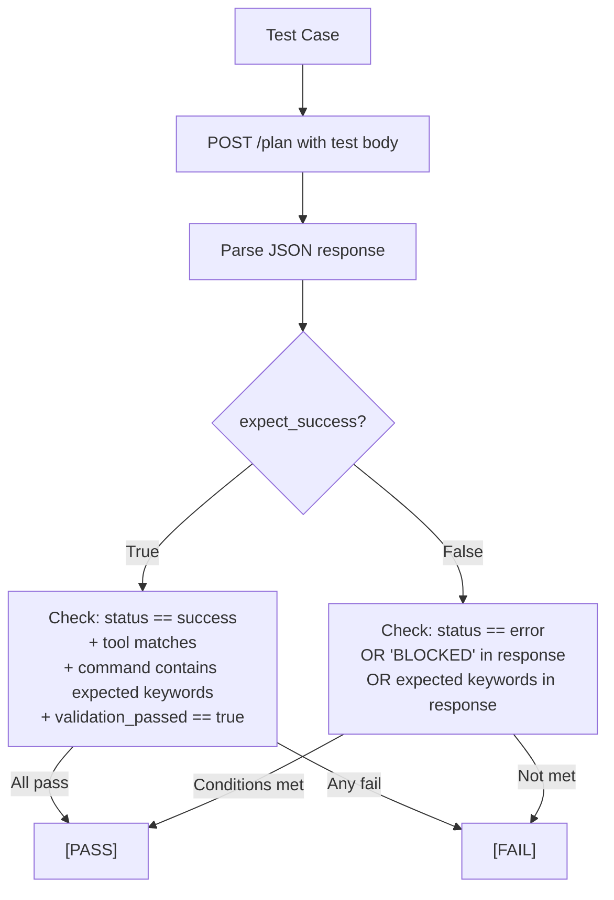
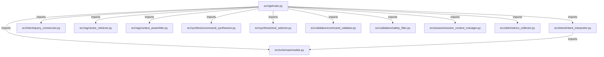

# 11 — Developer Guide

## 11.1 Project Setup (Local Development)

### Prerequisites

| Requirement | Version | Purpose |
|---|---|---|
| Python | 3.11+ | Runtime |
| Redis | 7.x | Session storage |
| Ollama | Latest | Local LLM inference |
| Git | Any | Version control |

### Initial Setup

```bash
# Clone the repository
git clone <repo-url>
cd neuroshell-planner

# Create and activate virtual environment
python -m venv venv

# Windows
venv\Scripts\activate

# Linux/Mac
source venv/bin/activate

# Install dependencies
pip install -r requirements.txt

# Copy and configure environment
cp .env.example .env
# Edit .env with your settings
```

### First-Run Sequence

```bash
# 1. Start Redis
redis-server

# 2. Pull the LLM model
ollama pull gemma4:e4b

# 3. Ingest the knowledge base
python scripts/ingest_docs.py

# 4. Start the development server
uvicorn src.api.main:app --host 0.0.0.0 --port 8002 --reload

# 5. Test health
curl http://localhost:8002/health
```

---

## 11.2 Running the Evaluation Harness

`scripts/evaluate_component.py` provides an end-to-end test of the `/plan` endpoint using four predefined test cases.

```bash
python scripts/evaluate_component.py
```

### Test Cases

| Name | Intent | Target | Tool | Expected Keywords | Expects Success |
|---|---|---|---|---|---|
| Nmap stealth scan | `NETWORK_SCAN` | `192.168.1.1` | `nmap` | `nmap`, `-sS`, `192.168.1.1` | ✅ Yes |
| Nikto SSL scan | `VULNERABILITY_AUDIT` | `10.0.0.8` | `nikto` | `nikto`, `-h`, `10.0.0.8`, `-p`, `443`, `-ssl` | ✅ Yes |
| Gobuster directory brute force | `DIRECTORY_BRUTEFORCE` | `10.0.0.5` | `gobuster` | `gobuster`, `dir`, `-u`, `10.0.0.5`, `-w` | ✅ Yes |
| Public IP safety block | `NETWORK_SCAN` | `8.8.8.8` | — | `SCOPE`, `RFC`, `private` | ❌ Blocked |

### Evaluation Logic



### Sample Output

```
NeuroShell C2 Full Component Evaluation
---------------------------------------------
[PASS] Nmap stealth scan -> nmap -sS 192.168.1.1
[PASS] Nikto SSL scan -> nikto -h 10.0.0.8 -p 443 -ssl
[PASS] Gobuster directory brute force -> gobuster dir -u http://10.0.0.5 -w /usr/share/wordlists/dirb/common.txt
[PASS] Public IP safety block -> Blocked correctly
---------------------------------------------
Passed: 4/4
Full Component Accuracy: 100.00%
```

---

## 11.3 Interactive API Testing

### FastAPI Interactive Docs

When the server is running, visit:

- **Swagger UI:** http://localhost:8002/docs
- **ReDoc:** http://localhost:8002/redoc

### cURL Examples

**Health check:**
```bash
curl http://localhost:8002/health
```

**Basic NETWORK_SCAN (enriched format):**
```bash
curl -X POST http://localhost:8002/plan \
  -H "Content-Type: application/json" \
  -H "x-api-key: <your-api-key>" \
  -d '{
    "session_id": "dev-001",
    "intent": "NETWORK_SCAN",
    "target_type": "IP",
    "target_value": "192.168.1.100",
    "primary_tool": "nmap",
    "confidence": 0.97,
    "tool_parameters": {
      "flags": ["stealth"],
      "ports": [80, 443]
    }
  }'
```

**Legacy contract format:**
```bash
curl -X POST http://localhost:8002/plan \
  -H "Content-Type: application/json" \
  -H "x-api-key: <your-api-key>" \
  -d '{
    "session_id": "dev-002",
    "intent_contract": {
      "intent": "VULNERABILITY_AUDIT",
      "target": {"type": "IP", "value": "10.0.0.5"},
      "ports": [443],
      "modifiers": ["ssl"],
      "cve_ids": [],
      "tool_hint": "nikto",
      "confidence": 0.95,
      "rejection_reason": null,
      "scope_warnings": []
    }
  }'
```

**Test REJECTED intent:**

The flat-field format works here because `main.py` builds an `IREIntentContract` from flat fields when `intent_contract` is absent. The `REJECTED` guard fires before any RAG or LLM processing:
```bash
curl -X POST http://localhost:8002/plan \
  -H "Content-Type: application/json" \
  -H "x-api-key: <your-api-key>" \
  -d '{
    "session_id": "dev-003",
    "intent": "REJECTED",
    "target_value": "192.168.1.1",
    "rejection_reason": "Intent was classified as out-of-scope.",
    "confidence": 0.0
  }'
```

**Get metrics:**
```bash
curl -H "x-api-key: <your-api-key>" http://localhost:8002/metrics
```

---

## 11.4 Adding a New Intent

1. **Schema** (`src/schemas/models.py`): Add the new intent code to the `Literal` in `IREIntentContract`.
2. **Query template** (`src/intent/query_constructor.py`): Add an entry to `QUERY_TEMPLATES`.
3. **Tool map** (`data/tool_map.json`): Add the intent → tool mapping.
4. **Default ports** (`src/intent/intent_interpreter.py`): Add a case in `_default_ports()` if needed.
5. **Modifier map** (`src/intent/query_constructor.py`): Add any new modifiers to `MODIFIER_TEXT_MAP`.
6. **Validator** (`src/validation/command_validator.py`): Add `TOOL_REQUIRED_FLAGS` and `TOOL_PATTERNS` entries for any new tool.
7. **Safety filter** (`src/validation/safety_filter.py`): Add the new tool to `ALLOWED_TOOLS`.
8. **Knowledge base**: Add a `knowledge_base/raw_docs/<newtool>.txt` file and re-run ingestion.

---

## 11.5 Module Dependency Graph



> All modules except `main.py` are stateless or self-contained. `main.py` is the single orchestration point.

---

## 11.6 Standalone Module Testing

Each module includes a `if __name__ == "__main__":` block for standalone testing:

```bash
# Test VectorRetriever
python -m src.rag.vector_retriever

# Test SessionContextManager
python -m src.session.session_context_manager

# Test CommandValidator
python -m src.validation.command_validator

# Test SafetyFilter
python -m src.validation.safety_filter

# Test MetricsCollector
python -m src.utils.metrics_collector

# Test CommandSynthesizer (full pipeline)
python -m src.synthesis.command_synthesizer
```

---

## 11.7 Common Errors & Fixes

| Error | Cause | Fix |
|---|---|---|
| `redis.exceptions.ConnectionError` | Redis offline | Handled gracefully via `SessionContextManager` memory fallback; start Redis (`redis-server`) for persistent storage |
| `ollama.ResponseError: model not found` | Model not pulled | `ollama pull gemma4:e4b` |
| `chromadb.errors.NotFoundError` | KB not ingested | Run `python scripts/ingest_docs.py` |
| `401 Invalid API key` | Wrong header value | Pass matching `API_KEY` in `x-api-key` header |
| `400 INTENT_REJECTED` | Intent is `REJECTED` | Check C1 output; ensure valid intent |
| `400 Safety check failed: BLOCKED: target ... not RFC-1918` | Public IP target | Use private IP range targets (192.168.x.x, 10.x.x.x) |
| `422 Command structural validation failed` | Malformed/empty command | Verify generated command matches required binary & flags |
| `ImportError: No module named 'src'` | Wrong working directory | Run commands from project root |

---

## 11.8 Running Tests

```bash
# Run all unit and integration tests (51 / 51 passing tests, 0 failures)
pytest tests/ -v

# Run unit tests only
pytest tests/unit/ -v

# Run integration tests only
pytest tests/integration/ -v
```

