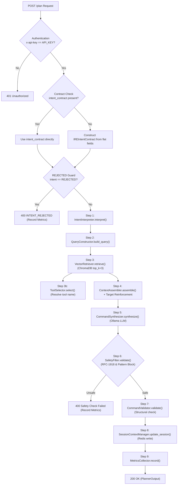
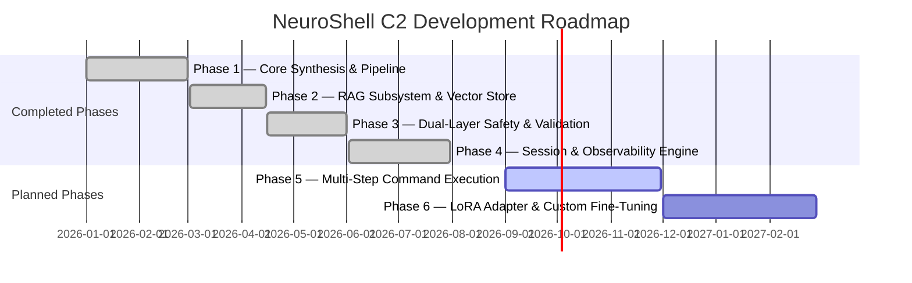

# 13 — Master Plan

> **Component:** C2 — Dynamic Planner & RAG Engine  
> **System:** NeuroShell Automated Penetration Testing Framework  
> **Status:** Phase 1–4 Implemented & Verified | Phase 5–6 Planned

---

## 13.1 Executive Summary & Vision

The **NeuroShell Dynamic Planner & RAG Engine (C2)** is an autonomous, RAG-powered command synthesis microservice designed for penetration testing operations. C2 bridges high-level security intent (received from C1 — Intent Recognition Engine) and command execution (handled by C3 — Adaptive Execution & Error Recovery Engine).

C2 translates structured intent specifications (`IREIntentContract`) into precise, syntactically correct, and safety-verified Kali Linux CLI tool invocations (`PlannerOutput`). By combining Retrieval-Augmented Generation (RAG) over authoritative tool documentation with local LLM synthesis (Gemma via Ollama) and a strict dual-layer safety guard, C2 eliminates command syntax hallucinations, enforces target scope boundaries, and operates completely offline without external cloud dependencies.

---

## 13.2 System Placement in NeuroShell Architecture

C2 operates strictly as a **planning and synthesis microservice**. It does **not** execute system commands or interact directly with target networks.

```mermaid
graph TB
    subgraph C1["Component 01 — Intent Recognition Engine (IRE)"]
        NLP["Natural Language Processor"]
        CONTRACT["IREIntentContract Synthesizer"]
        NLP --> CONTRACT
    end

    subgraph C2["Component 02 — Dynamic Planner & RAG Engine (THIS COMPONENT)"]
        API["FastAPI Gateway (src/api/main.py)"]
        INTENT["Intent Interpreter"]
        QUERY["Query Constructor"]
        RAG["Vector Retriever (ChromaDB)"]
        PROMPT["Context Assembler"]
        LLM["Command Synthesizer (Ollama Gemma)"]
        SAFETY["Safety Filter (RFC-1918 & Dangerous Patterns)"]
        VALID["Command Validator"]
        SESSION["Session Context Manager (Redis)"]
        METRICS["Metrics Collector"]

        API --> INTENT --> QUERY --> RAG --> PROMPT --> LLM --> SAFETY --> VALID --> SESSION --> METRICS
    end

    subgraph C3["Component 03 — Adaptive Execution & Error Recovery Engine"]
        EXEC["Command Execution Engine"]
        RETRY["Adaptive Retry & Error Recovery"]
        EXEC <--> RETRY
    end

    subgraph C4["Component 04 — AI-Driven Vulnerability Analysis Engine"]
        ANALYSIS["Log & Vulnerability Analyzer"]
    end

    CONTRACT -->|POST /plan (IREIntentContract)| API
    METRICS -->|200 OK (PlannerOutput)| EXEC
    EXEC -->|Raw Tool Logs| ANALYSIS
```

---

## 13.3 Core Pipeline Architecture



---

## 13.4 Development Roadmap & Phased Milestones



### Phase Details

#### Phase 1 — Core Pipeline Architecture & Synthesis Engine (Status: ✅ Verified & Complete)
- FastAPI application scaffolding with `/health`, `/plan`, `/tools/available`, and `/metrics`.
- Intent parameter extraction via `IntentInterpreter` supporting enriched (C1 v2) and legacy (C1 v1) contract formats.
- Integration with local Ollama LLM runtime using `gemma4:e4b`.
- Markdown code-fence stripping post-processing for clean bash output.

#### Phase 2 — Knowledge Base & RAG Subsystem (Status: ✅ Verified & Complete)
- Raw documentation storage for supported tools (`nmap`, `nikto`, `gobuster`) in `knowledge_base/raw_docs/`.
- Offline chunking algorithm (`80` words, `20`-word overlap) and embedding pipeline using `sentence-transformers/all-MiniLM-L6-v2`.
- ChromaDB vector store setup (`tool_documentation` collection, cosine distance).
- Semantic query construction via `QueryConstructor` with template lookup and modifier expansion.
- Context assembly formatting docs by tool section with target reinforcement rules.

#### Phase 3 — Dual-Layer Safety & Validation Engine (Status: ✅ Verified & Complete)
- **Layer 1 (`SafetyFilter`):** Pre-execution blocking of destructive patterns (`rm -rf`, `mkfs`, `dd`, fork bomb, reverse shells) and strict enforcement of RFC-1918 private IPv4 scope (`192.168.x.x`, `10.x.x.x`, `172.16-31.x.x`, `127.x.x.x`, `localhost`).
- **Layer 2 (`CommandValidator`):** Structural validation enforcing correct tool binary prefixes (`nmap`, `nikto`, `gobuster`), non-empty/single-line constraints, and presence of mandatory flags.
- Early `REJECTED` intent interception before RAG or LLM resource consumption.

#### Phase 4 — Session State & Observability (Status: ✅ Verified & Complete)
- Redis-backed session tracking (`SessionContextManager`) with sliding 1-hour TTL (`3600s`).
- In-memory metrics tracking (`MetricsCollector`) recording latency, success rates, and safety flags.
- Comprehensive end-to-end evaluation harness (`scripts/evaluate_component.py`).

#### Phase 5 — Multi-Step Sequencing & Dynamic Adaptive Planning (Status: ✅ Phase 5.1 Implemented & Verified | Phase 5.2–5.3 Future Work)
- Expanded `main.py` pipeline logic to branch on `params["multi_step"]` when `confidence > 0.85`.
- Generated multi-command output arrays (`command_sequence`) for complex intents (`EXPLOITATION`, `VULNERABILITY_AUDIT`) with per-command dual-layer safety and structural validation.
- Integrated `suggested_command` as prompt reference hint without bypassing safety or structural validators.

#### Phase 6 — LoRA Adapter & Model Fine-Tuning (Status: ✅ Phase 6.1–6.3 Completed & Evaluated)
- Generated synthetic training and evaluation dataset in `data/synthesis_dataset/` (`c2_sft_full.csv`, `c2_sft_train.csv`, `c2_sft_test.csv`, `c2_sft_validation.csv`).
- Trained lightweight LoRA adapter weights (`models/planner-lora-adapter/`) on `google/gemma-2-2b-it` (`q_proj+v_proj, r=16, alpha=32`).
- Converted trained adapter to GGUF and deployed in Ollama as `neuroshell-c2-gemma2:latest`.
- Completed empirical evaluation: Tuned Gemma 2 achieved 59.26% Semantic Accuracy (+33.33% gain over base Gemma 2 25.93%), 100% tool selection accuracy, and 96.3% validator pass rate.
- Retained base `gemma4:e4b` + RAG as default production model (80.0% accuracy on controlled 25-case benchmark).

---

## 13.5 Technology Stack Rationale

| Layer | Technology | Decision Rationale |
|---|---|---|
| API Framework | **FastAPI 0.111.0** | Asynchronous performance, automatic OpenAPI documentation, strict Pydantic model validation. |
| Vector Store | **ChromaDB 0.5.0** | Embedded, serverless local persistence, high performance for medium-scale documentation collections. |
| Embeddings | **all-MiniLM-L6-v2** | Compact 384-dimensional representations, rapid CPU/GPU inference, low memory overhead. |
| Default Production LLM | **Ollama (`gemma4:e4b`)** | Completely offline execution, strong instruction-following capabilities, high zero-shot accuracy (80.0% with RAG). |
| Experimental Fine-Tuned LLM | **Ollama (`neuroshell-c2-gemma2:latest`)** | Fine-tuned Gemma 2 2b-it GGUF model for domain-specific CLI flag generation (+33.33% gain over base). |
| Session Store | **Redis 5.0.4** | In-memory key-value caching with native TTL support for stateful multi-turn operation context. |

---

## 13.6 Proposal vs Implementation Summary

| Architectural Feature | Proposal Design | Implementation Status (v1.0) |
|---|---|---|
| Orchestration Framework | LangChain | Native Python orchestrator in `main.py` (LangChain in `requirements.txt` only) |
| Model Architecture | Fine-tuned LoRA model | **Completed & Verified (Experimental)**: Gemma 2 LoRA fine-tuning completed (`neuroshell-c2-gemma2:latest`). Default production uses base `gemma4:e4b`. |
| Execution Planning | Multi-command sequences | **Implemented & Verified**: Multi-command array generation (`command_sequence`) and per-command dual validation active in `main.py` |
| C3 Feedback Loop / Replanning | Adaptive error recovery | **Planned / Unimplemented**: Processing execution logs from C3 for dynamic replanning remains Phase 5.2/5.3 future work |
| KB Dynamic Updates | `/kb/update` endpoint | **Implemented & Verified** (`POST /kb/update` consuming `KBUpdateRequest`) |
| Admin Interface | Authenticated admin routes | **Implemented & Verified** (`ADMIN_KEY` protection on `/kb/update` and `/admin/*`) |
| Session Fault Tolerance | Redis session store | **Implemented & Verified** (Redis with in-memory fallback for graceful degradation) |
| Session Target Memory | Target tracking | **Implemented & Verified** (`get_last_target()` for missing/empty/UNKNOWN targets) |
| RAG Chunk Quality | Distance metric search | **Implemented & Verified** (ChromaDB search with default `0.30` score threshold) |
| Command Validation | Structural checks | **Implemented & Verified** (Strict `CommandValidator` enforcement returning `HTTP 422`) |
| Automated Testing | Unit & Integration | **Implemented & Verified** (51 / 51 tests passing across unit and integration suites, 0 failures) |


---

## 13.7 Governance, Compliance & Operational Boundaries

1. **No System Execution:** C2 generates text-based command strings only. Execution rights belong exclusively to C3.
2. **Local Air-Gapped Operation:** All embeddings, vector searches, and LLM inferences execute locally. No remote telemetry or cloud calls.
3. **Strict Target Guardrails:** Targets outside RFC-1918 private ranges are rejected by `SafetyFilter` prior to response generation.
