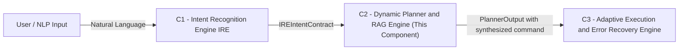

# NeuroShell Dynamic Planner — Documentation Hub

> **Component:** C2 — Dynamic Planner  
> **Version:** 1.0.0  
> **Port:** 8002  
> **Status:** Active

---

## 📚 Documentation Index

| Document | Description |
|---|---|
| [01 — System Overview](./01_system_overview.md) | Architecture, design goals, and component placement |
| [02 — API Reference](./02_api_reference.md) | All REST endpoints, request/response schemas |
| [03 — Data Models](./03_data_models.md) | Pydantic schemas, field descriptions, validation rules |
| [04 — Pipeline Flow](./04_pipeline_flow.md) | Step-by-step request lifecycle with Mermaid diagrams |
| [05 — Module Reference](./05_module_reference.md) | Per-module class and function documentation |
| [06 — RAG Subsystem](./06_rag_subsystem.md) | Knowledge base ingestion, embedding, retrieval |
| [07 — Safety & Validation](./07_safety_validation.md) | SafetyFilter, CommandValidator, blocked patterns |
| [08 — Session Management](./08_session_management.md) | Redis-backed session lifecycle |
| [09 — Metrics & Observability](./09_metrics_observability.md) | MetricsCollector, summary endpoint |
| [10 — Configuration & Deployment](./10_configuration_deployment.md) | Environment variables, startup, dependencies |
| [11 — Developer Guide](./11_developer_guide.md) | Local setup, testing, evaluation script |
| [12 — Glossary](./12_glossary.md) | Terms, acronyms, intent codes |
| [13 — Master Plan](./13_master_plan.md) | Project vision, architecture, and phased roadmap |
| [14 — TODO Checklist](./14_todo_checklist.md) | Module-by-module implementation & task verification checklist |

---

## Quick Start

```bash
# 1. Install dependencies
pip install -r requirements.txt

# 2. Ingest knowledge base
python scripts/ingest_docs.py

# 3. Start API server
uvicorn src.api.main:app --host 0.0.0.0 --port 8002 --reload

# 4. Health check
curl http://localhost:8002/health
```

---

## Component Role in NeuroShell

> **Scope:** C2 **plans, generates, and validates** commands. It does **not** execute them. Command execution is the responsibility of C3.



C2 receives a structured `IREIntentContract` from C1, retrieves relevant tool documentation via RAG, synthesizes a Kali Linux command using a local LLM (Gemma via Ollama), validates and safety-checks it, then returns a `PlannerOutput` for C3 to execute.
